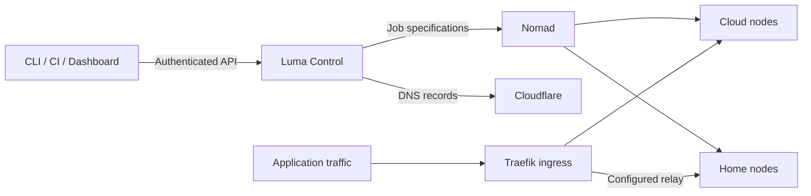

<p align="center">
  
</p>

<h1 align="center">Luma</h1>

<p align="center">
  <strong>Your servers. One deployment workflow.</strong><br />
  A self-hosted control plane for deploying containers across cloud and home infrastructure.
</p>

<p align="center">
  <a href="https://pypi.org/project/luma-infra/"></a>
  <a href="pyproject.toml"></a>
  <a href="LICENSE"></a>
</p>

<p align="center">
  <a href="https://liutianjie.github.io/luma/">Website</a> ·
  <a href="docs/bootstrap.md">Getting started</a> ·
  <a href="docs/dashboard-guide.md">Console guide</a> ·
  <a href="https://github.com/LiuTianjie/luma/releases">Releases</a> ·
  <a href="README.zh-CN.md">简体中文</a>
</p>

---

Luma turns a handful of servers into a deployment platform you can operate from your laptop, CI, or browser. Describe a service in YAML, choose where it runs and how it is reached, then deploy through one authenticated API.

Underneath, **Nomad schedules containers, Traefik routes traffic, and Cloudflare manages DNS**. Luma connects those pieces with application history, secrets, builds, node management, and a web console. Deployment clients carry a management token; infrastructure credentials stay with the control plane.

```yaml
# status.yaml
name: status
image: traefik/whoami:v1.10.3
region: cn
exposure: cn-edge
domain: status.example.com
port: 80
```

```bash
luma validate status.yaml
luma deploy status.yaml --dry-run
luma deploy status.yaml
```

The example assumes an initialized manager and a domain in your Cloudflare zone. [Set up your first manager below.](#quick-start)

## Why Luma

- **One workflow across your machines.** Place services in `cn`, `global`, `home`, or custom regions. Pin a workload to a named node when placement matters.
- **Separate placement from networking.** Run a service at home and expose it through a public relay, or run a cloud worker with no public ingress.
- **Start from an image or a repository.** Deploy existing images, build on your machine, or import a GitHub/Gitea repository through a configured Builder.
- **Operate from the console.** Inspect applications, logs, routes, builds, registry images, and node health. Manage upgrades with visible progress and route checks.
- **Keep delivery reproducible.** Validate manifests, preview a deployment, inspect job history, and roll back a Nomad job version. CI uses the same API as the CLI.
- **Keep configuration scoped.** Application secrets and private registry credentials are managed centrally; manifests reference values without embedding them.

Luma fits personal infrastructure and small teams running web apps, APIs, and workers on a few machines. The control plane currently uses **one Manager with local SQLite storage**. Multi-active Manager high availability and Kubernetes-style tenant isolation are outside that model. See [storage and recovery](docs/control-storage.md) before relying on it for production.

## Quick start

### 1. Install the CLI

On the manager and any machine you want to deploy from:

```bash
curl -fsSL https://raw.githubusercontent.com/LiuTianjie/luma/main/scripts/install-luma.sh | sh
~/.local/bin/luma preflight
```

The installer creates an isolated Python environment and places `luma` in `~/.local/bin`. Open a new shell if that directory is not yet on your `PATH`. Installing the CLI does not bootstrap a server.

<details>
<summary>Install a pinned version with pip</summary>

Python 3.9+ is required. Use a virtual environment on systems with externally managed Python:

```bash
python -m venv .venv
. .venv/bin/activate
python -m pip install "luma-infra==0.1.366"
```

See [installation lifecycle](docs/installation-lifecycle.md) for runtime diagnostics and uninstall behavior.

</details>

### 2. Bootstrap one manager

Have these ready:

| Requirement | Purpose |
| --- | --- |
| A Linux server; Ubuntu 22.04+ is the documented starting point | Runs Luma Control, Nomad, and Traefik; 2 CPU cores / 2 GB RAM is an evaluation starting point |
| A domain managed in Cloudflare | Control API and application domains |
| A Cloudflare API token with Zone Read and DNS Edit | DNS record management |
| Public ports 80/443 and an ACME email address | HTTP ingress and HTTPS certificates |
| Access to the configured container registry | Pulls the Control image and application images |

Run **on the manager**:

```bash
luma bootstrap manager --domain luma.example.com
```

The CLI prompts for missing values, provisions the runtime, initializes SQLite, and prints the dashboard URL, **management token**, and **node join token**. Keep both tokens private.

If the manager needs a proxy to pull the default GHCR image, configure `EGRESS_SUBSCRIPTION_URL` before bootstrap. This is especially relevant on mainland China hosts. Tailscale, a Builder Registry, and the optional LAE application engine are not prerequisites for the first single-manager workload. See the [bootstrap guide](docs/bootstrap.md) for network and host setup.

### 3. Run the first workload

Open `https://luma.example.com/dashboard/`, sign in with the management token, and choose **Applications → Create application → hello-world first install**.

This deploys the repository's [hello-world template](templates/hello-world.yml) with `exposure: none`. It verifies scheduling without adding an application domain. For a public service, use `status.yaml` above with a domain you own.

From a laptop or CI machine, authenticate and deploy through Control:

```bash
luma login https://luma.example.com --token '<management-token>'
luma deploy status.yaml
luma status
luma history status
```

Image deployment clients need the CLI and access to Control. Local source builds additionally need Docker/Buildx.

## How it works



The deployment path and the application traffic path are separate. Control submits jobs; application requests go through the configured ingress. Each workload runs on a Nomad client using the Docker driver.

### Placement and exposure

| Field | Answers | Examples |
| --- | --- | --- |
| `region` | Where may this service run? | `cn`, `global`, `home`, or a custom region |
| `node` | Must it run on a particular machine? | The name registered by `luma node join --name` |
| `exposure` | How do clients reach it? | `cn-edge`, `external-edge`, `tailscale-relay`, `tcp-relay`, `cloudflare-tunnel`, `none` |
| `proxy` | Does the container need runtime outbound proxying? | `true` attaches configured egress |

For example, `region: home` with `exposure: tailscale-relay` places the workload on a home node and sends public traffic through an edge relay over Tailscale. `region: cn` with `exposure: none` runs an internal workload without public ingress.

A node pin still respects the region constraint. Runtime `proxy: true` and image-pull networking are separate concerns. The [concepts](docs/concepts.md) and [exposure model](docs/exposure-model.md) explain these boundaries.

## Deployment workflows

| Starting point | Entry point | What happens |
| --- | --- | --- |
| Published container image | `luma deploy app.yaml` | Deploys the image declared in the manifest |
| Local source checkout | `luma build local . --platform linux/amd64` | Builds with local Docker/Buildx, uploads to the configured Builder Registry, then deploys |
| GitHub or Gitea repository | `luma import <repository-url>` | Builds on a configured Builder and deploys the result |
| Multi-service Compose app | `luma compose deploy luma.compose.yml` | Deploys an existing Compose file with Luma placement and exposure configuration |

**`luma deploy` does not build your source.** Choose the build/import workflow when you need a new image. Builder workflows require Builder and Registry setup; plain image deployment does not.

For public services, add a meaningful application health check and explicit memory limits. Rolling behavior depends on ports, volumes, and placement; a successful local validation alone does not prove runtime readiness. Field definitions and examples live in the [manifest reference](docs/deployment-yaml.md).

### Secrets and CI

Keep sensitive values in a local environment file or the secret store:

```yaml
env:
  DATABASE_URL: ${DATABASE_URL}
```

```bash
luma deploy app.yaml --env .env
# Or store a value interactively under the manifest's application name:
luma secret set DATABASE_URL --scope app
```

Only referenced variables are imported, under the application's scope. Registry credentials use `luma registry login`, separately from application environment variables.

CI can use environment variables without creating a persistent login context:

```bash
export LUMA_CONTROL_URL="https://luma.example.com"
export LUMA_DEPLOY_TOKEN="$CI_LUMA_MANAGEMENT_TOKEN"

luma validate app.yaml --format json
luma deploy app.yaml --dry-run --format json
luma deploy app.yaml --format ndjson --timeout 3000
```

`LUMA_DEPLOY_TOKEN` is the compatibility name for the **management token**. Treat it as an administrative credential.

### Add a node

Run this **on the new node**, using the node join token printed during bootstrap:

```bash
luma node join https://luma.example.com \
  --token '<node-join-token>' \
  --region global \
  --name global-worker-1
```

Home/private nodes require Tailscale. macOS home nodes also need a running Docker environment such as Docker Desktop or OrbStack. Per-node agent credentials are installed and managed automatically. See [node setup](docs/bootstrap.md) and [node labels](docs/node-labels.md).

## Operations at a glance

| Task | Entry point |
| --- | --- |
| Check cluster health | `luma status` and `luma doctor` |
| Inspect deployment versions | `luma history <app>` |
| Roll back a Nomad job version | `luma rollback <app> --to-version <N>` |
| Upgrade Control and nodes | Dashboard → Nodes → Update center |
| Inspect registry storage | Dashboard → Registry |
| Configure application telemetry and alerts | [Observability](docs/observability.md) and the independent [Observe stack](observe/) |
| Back up or recover Manager state | [Control storage and recovery](docs/control-storage.md) |

Rollback restores a Nomad job version; it does not restore application data. Use immutable images and keep volume/database backups separately. Registry garbage collection is irreversible, and Dashboard **Delete and reclaim** has no recovery window; the CLI's queued deletion workflow offers a cancellable window before GC. Read the [console guide](docs/dashboard-guide.md) before reclaiming storage.

## Documentation

| Start here | Go deeper |
| --- | --- |
| [Bootstrap](docs/bootstrap.md) | [Installation lifecycle](docs/installation-lifecycle.md) |
| [Console guide](docs/dashboard-guide.md) | [Operations](docs/operations.md) |
| [Manifest reference](docs/deployment-yaml.md) | [Compose and storage](docs/compose-storage.md) |
| [Concepts](docs/concepts.md) | [Exposure model](docs/exposure-model.md) |
| [Secrets](docs/secrets.md) | [CLI reference](docs/luma-cli-reference.md) |
| [Troubleshooting](docs/troubleshooting.md) | [Control storage and recovery](docs/control-storage.md) |
| [Agent skills](docs/agent-skill.md) | [Optional LAE application engine](docs/lae/README.md) |

## Development and contributions

```bash
git clone https://github.com/LiuTianjie/luma.git
cd luma
./scripts/install-luma.sh
. .venv/bin/activate
python -m pip install -e '.[test]'
npm ci
bash scripts/check-luma.sh
```

The source gate checks version references, generated CLI docs, dashboard types/builds, Python tests, dashboard tests, and whitespace. Dashboard source lives in `dashboard-src/`; its build is packaged into `luma/assets/dashboard/`.

Focused fixes, reproducible bug reports, and documentation improvements are welcome. For infrastructure bugs, include the Luma version, node role, manifest with secrets removed, expected behavior, and relevant diagnostics. Never post tokens or proxy subscription URLs. See [release process](docs/release.md) and [website maintenance](docs/website.md) for maintainer workflows.

## Security and license

Management tokens grant broad access to your cluster. Use the dashboard only on trusted devices; it stores the token in browser local storage. Keep Cloudflare credentials, registry credentials, join tokens, and agent credentials out of repositories and issue reports.

Luma is released under the [MIT License](LICENSE). Bundled and external dependencies retain their own licenses.
