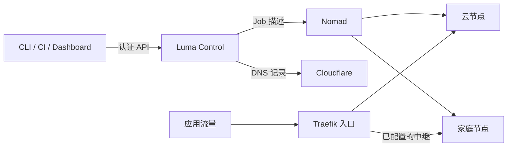

<p align="center">
  
</p>

<h1 align="center">Luma</h1>

<p align="center">
  <strong>自己的服务器，统一的部署方式。</strong><br />
  面向云服务器与家庭节点的自托管容器部署控制面。
</p>

<p align="center">
  <a href="https://pypi.org/project/luma-infra/"></a>
  <a href="pyproject.toml"></a>
  <a href="LICENSE"></a>
</p>

<p align="center">
  <a href="https://liutianjie.github.io/luma/zh.html">官网</a> ·
  <a href="docs/bootstrap.zh-CN.md">开始使用</a> ·
  <a href="docs/dashboard-guide.zh-CN.md">控制台指南</a> ·
  <a href="https://github.com/LiuTianjie/luma/releases">版本发布</a> ·
  <a href="README.md">English</a>
</p>

---

Luma 把分散的几台服务器组织成一个可以从电脑、CI 和浏览器操作的部署平台。用 YAML 描述服务，指定运行位置和访问方式，再通过统一的认证 API 完成部署。

底层由 **Nomad 调度容器、Traefik 转发流量、Cloudflare 管理 DNS**。Luma 将它们连接起来，提供应用历史、密钥、构建、节点管理和 Web 控制台。部署客户端只持有管理令牌，基础设施凭据留在控制面。

```yaml
# status.yaml
name: status
image: traefik/whoami:v1.10.3
region: cn
exposure: cn-edge
domain: status.example.com
port: 80
```

```bash
luma validate status.yaml
luma deploy status.yaml --dry-run
luma deploy status.yaml
```

这个示例需要已经初始化的 Manager，以及你在 Cloudflare 中管理的域名。首次使用请从下面的[快速开始](#快速开始)进入。

## 为什么选择 Luma

- **多台机器，同一种部署方式。** 将服务部署到 `cn`、`global`、`home` 或自定义区域；需要固定位置时，可指定节点名称。
- **运行位置与访问方式分别声明。** 家庭节点上的服务可以经公网中继访问，云服务器上的后台任务也可以完全不开放公网入口。
- **从镜像或源码开始。** 支持已有镜像、本地构建，以及通过已配置的 Builder 导入 GitHub / Gitea 仓库。
- **在控制台完成日常操作。** 查看应用、日志、路由、构建、镜像与节点健康；升级进度和公网路由检查结果可直接追踪。
- **部署过程可以检查和追溯。** 校验清单、预览部署、查看版本、回滚 Nomad Job；CI 与 CLI 使用同一个 API。
- **配置按应用隔离。** 集中管理应用密钥和私有镜像仓库凭据，部署清单通过变量引用敏感值。

Luma 适合在少量机器上运行 Web、API 和 Worker 的个人开发者与小团队。目前控制面采用 **单 Manager + 本地 SQLite**，不提供多活 Manager 高可用或 Kubernetes 式租户隔离。用于生产前，请阅读[存储与恢复说明](docs/control-storage.zh-CN.md)。

## 快速开始

### 1. 安装 CLI

在 Manager 和需要发起部署的机器上安装：

```bash
curl -fsSL https://raw.githubusercontent.com/LiuTianjie/luma/main/scripts/install-luma.sh | sh
~/.local/bin/luma preflight
```

安装器会创建独立的 Python 环境，将 `luma` 放到 `~/.local/bin`。若该目录尚未进入 `PATH`，重新打开终端即可。安装 CLI 本身不会初始化服务器。

<details>
<summary>使用 pip 安装固定版本</summary>

需要 Python 3.9+。系统 Python 受包管理器管理时，请使用虚拟环境：

```bash
python -m venv .venv
. .venv/bin/activate
python -m pip install "luma-infra==0.1.366"
```

运行时诊断与卸载行为见[安装生命周期](docs/installation-lifecycle.zh-CN.md)。

</details>

### 2. 初始化第一台 Manager

准备以下资源：

| 要求 | 用途 |
| --- | --- |
| 一台 Linux 服务器；文档以 Ubuntu 22.04+ 为起点 | 运行 Luma Control、Nomad 和 Traefik；2 核 / 2 GB 内存可作为体验起点 |
| 一个由 Cloudflare 管理的域名 | 控制面与应用域名 |
| 具有 Zone Read 和 DNS Edit 权限的 Cloudflare API Token | 管理 DNS 记录 |
| 公网 80/443 端口与 ACME 邮箱 | HTTP 入口与 HTTPS 证书 |
| 能够访问配置的容器镜像仓库 | 拉取 Control 和应用镜像 |

**在 Manager 上**执行：

```bash
luma bootstrap manager --domain luma.example.com
```

CLI 会交互式补齐配置、准备运行环境、初始化 SQLite，并输出控制台地址、**管理令牌**和**节点加入令牌**。请妥善保管这两个令牌。

如果 Manager 需要代理才能拉取默认 GHCR 镜像，请在初始化前配置 `EGRESS_SUBSCRIPTION_URL`，中国大陆服务器尤其需要确认这一点。第一台 Manager 的基础工作负载不依赖 Tailscale、Builder Registry 或可选的 LAE 应用引擎。主机与网络配置详见[初始化指南](docs/bootstrap.zh-CN.md)。

### 3. 部署第一个服务

打开 `https://luma.example.com/dashboard/`，使用管理令牌登录，进入 **Applications → Create application → hello-world first install**。

这个入口部署仓库中的 [hello-world 模板](templates/hello-world.yml)，使用 `exposure: none`，无需新增应用域名即可验证调度。需要公网访问时，将上面的 `status.yaml` 换成自己的域名后部署。

在电脑或 CI 机器上，通过 Control 登录和部署：

```bash
luma login https://luma.example.com --token '<management-token>'
luma deploy status.yaml
luma status
luma history status
```

部署已有镜像的客户端只需安装 CLI 并能够访问 Control；本地源码构建还需要 Docker / Buildx。

## 工作原理



部署请求和业务流量走不同路径：Control 提交任务，业务请求通过配置的入口访问应用。工作负载由 Nomad Client 使用 Docker Driver 运行。

### 调度与入口

| 字段 | 回答的问题 | 示例 |
| --- | --- | --- |
| `region` | 服务可以运行在哪里？ | `cn`、`global`、`home` 或自定义区域 |
| `node` | 是否必须运行在某台机器？ | `luma node join --name` 注册的节点名称 |
| `exposure` | 客户端如何访问它？ | `cn-edge`、`external-edge`、`tailscale-relay`、`tcp-relay`、`cloudflare-tunnel`、`none` |
| `proxy` | 容器运行时是否需要出站代理？ | `true` 接入已配置的 egress |

例如，`region: home` 配合 `exposure: tailscale-relay`，将服务运行在家庭节点，公网流量经过边缘节点和 Tailscale 转发；`region: cn` 配合 `exposure: none`，则运行没有公网入口的内部服务。

指定 `node` 后仍须满足区域约束。运行时 `proxy: true` 与镜像拉取网络分别配置。详见[核心概念](docs/concepts.zh-CN.md)与[入口模型](docs/exposure-model.zh-CN.md)。

## 部署方式

| 起点 | 命令入口 | 执行内容 |
| --- | --- | --- |
| 已发布的容器镜像 | `luma deploy app.yaml` | 部署清单声明的镜像 |
| 本地源码 | `luma build local . --platform linux/amd64` | 通过本地 Docker / Buildx 构建，上传到已配置的 Builder Registry，再部署 |
| GitHub / Gitea 仓库 | `luma import <repository-url>` | 在已配置的 Builder 上构建并部署 |
| 多服务 Compose 应用 | `luma compose deploy luma.compose.yml` | 使用已有 Compose 文件及 Luma 调度、入口配置进行部署 |

**`luma deploy` 不会构建源码。** 需要新镜像时应选择构建或导入流程。Builder 工作流需要配置 Builder 和 Registry，直接部署已有镜像则不需要。

公网服务应设置有业务意义的健康检查和明确的内存限制。滚动更新行为取决于端口、持久卷与调度约束；本地校验通过并不代表实际服务已经就绪。字段定义与示例见[部署清单参考](docs/deployment-yaml.zh-CN.md)。

### 密钥与 CI

敏感值放在本地环境文件或密钥存储中：

```yaml
env:
  DATABASE_URL: ${DATABASE_URL}
```

```bash
luma deploy app.yaml --env .env
# 或交互式写入密钥；scope 使用清单中的应用名称：
luma secret set DATABASE_URL --scope app
```

只会导入清单引用的变量，并按应用隔离。镜像仓库凭据通过 `luma registry login` 管理，与应用环境变量分开。

CI 可以通过环境变量认证，无需创建持久化登录上下文：

```bash
export LUMA_CONTROL_URL="https://luma.example.com"
export LUMA_DEPLOY_TOKEN="$CI_LUMA_MANAGEMENT_TOKEN"

luma validate app.yaml --format json
luma deploy app.yaml --dry-run --format json
luma deploy app.yaml --format ndjson --timeout 3000
```

`LUMA_DEPLOY_TOKEN` 是**管理令牌**沿用的环境变量名，应按管理凭据保管。

### 加入节点

使用初始化时输出的节点加入令牌，**在新节点上**执行：

```bash
luma node join https://luma.example.com \
  --token '<node-join-token>' \
  --region global \
  --name global-worker-1
```

家庭和私有节点需要 Tailscale；macOS 家庭节点还需运行 Docker Desktop 或 OrbStack 等 Docker 环境。每个节点的 Agent 凭据由 Luma 自动安装和管理。详见[节点准备](docs/bootstrap.zh-CN.md)与[节点标签](docs/node-labels.md)。

## 常用操作

| 任务 | 入口 |
| --- | --- |
| 检查集群健康 | `luma status` 和 `luma doctor` |
| 查看部署版本 | `luma history <app>` |
| 回滚 Nomad Job 版本 | `luma rollback <app> --to-version <N>` |
| 升级 Control 与节点 | Dashboard → Nodes → Update center |
| 查看镜像仓库空间 | Dashboard → Registry |
| 配置应用指标与告警 | [可观测性](docs/observability.zh-CN.md)与独立的 [Observe 栈](observe/) |
| 备份或恢复 Manager 状态 | [Control 存储与恢复](docs/control-storage.zh-CN.md) |

回滚恢复的是 Nomad Job 版本，不会恢复应用数据；应使用不可变镜像，并单独备份持久卷与数据库。Registry GC 不可逆，控制台 **Delete and reclaim** 没有恢复窗口；CLI 的排队删除流程在 GC 前提供可取消的时间窗口。回收空间前请阅读[控制台指南](docs/dashboard-guide.zh-CN.md)。

## 文档导航

| 开始使用 | 深入了解 |
| --- | --- |
| [初始化](docs/bootstrap.zh-CN.md) | [安装生命周期](docs/installation-lifecycle.zh-CN.md) |
| [控制台指南](docs/dashboard-guide.zh-CN.md) | [日常运维](docs/operations.zh-CN.md) |
| [部署清单](docs/deployment-yaml.zh-CN.md) | [Compose 与存储](docs/compose-storage.zh-CN.md) |
| [核心概念](docs/concepts.zh-CN.md) | [入口模型](docs/exposure-model.zh-CN.md) |
| [密钥管理](docs/secrets.zh-CN.md) | [CLI 参考](docs/luma-cli-reference.zh-CN.md) |
| [故障排查](docs/troubleshooting.zh-CN.md) | [Control 存储与恢复](docs/control-storage.zh-CN.md) |
| [Agent 技能](docs/agent-skill.md) | [可选的 LAE 应用引擎](docs/lae/README.md) |

## 开发与贡献

```bash
git clone https://github.com/LiuTianjie/luma.git
cd luma
./scripts/install-luma.sh
. .venv/bin/activate
python -m pip install -e '.[test]'
npm ci
bash scripts/check-luma.sh
```

源码检查覆盖版本引用、自动生成的 CLI 文档、Dashboard 类型与构建、Python 测试、Dashboard 测试以及空白格式。控制台源码位于 `dashboard-src/`，构建结果打包到 `luma/assets/dashboard/`。

欢迎提交聚焦的问题修复、可复现的 Bug 报告与文档改进。报告基础设施问题时，请附上 Luma 版本、节点角色、去除密钥的清单、预期行为和相关诊断，不要公开令牌或代理订阅地址。维护流程见[版本发布](docs/release.zh-CN.md)与[网站维护](docs/website.zh-CN.md)。

## 安全与许可证

管理令牌拥有广泛的集群操作权限。控制台会将令牌存储在浏览器 Local Storage 中，请仅在可信设备上使用。Cloudflare 凭据、镜像仓库凭据、加入令牌和节点 Agent 凭据都不应进入仓库或 Issue。

Luma 使用 [MIT License](LICENSE) 发布。捆绑组件与外部依赖仍遵循各自的许可证。
