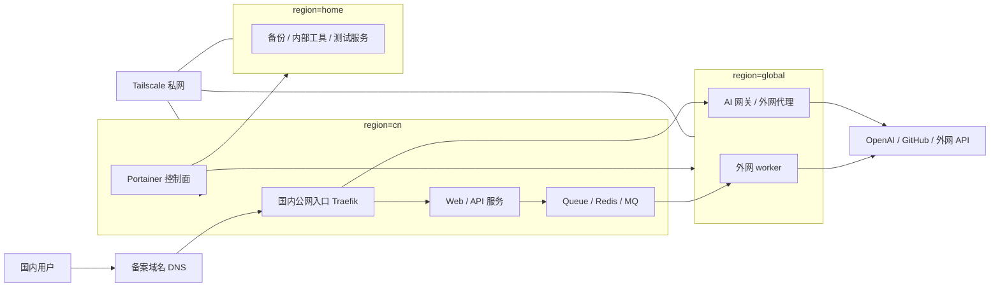

# Architecture

`infra-stacks` 的目标是用一个轻量控制面管理多台服务器上的 Docker 服务，同时保持清晰的 region 边界。

## 总体原则

- 国内用户入口只走备案域名和国内 Traefik。
- `cn` 是主要业务服务区域，承载公开 Web/API、数据库、Redis、Traefik 和 Portainer。
- `global` 是外网能力区域，承载 AI 网关、外网 API 调用、爬虫、代理和 worker。
- `home` 是非核心区域，承载备份、内部工具和低频测试任务。
- Portainer 是统一管理控制面。
- Tailscale 是跨服务器私网。
- 公开服务通过 Traefik labels 接入域名和 HTTPS。
- 跨 region 调用优先走队列，不建议国内 API 实时强依赖海外 HTTP。

## 架构图

## Region 职责

### cn

`cn` 是默认生产业务区域。国内公开服务、核心 API、数据库、Redis、Traefik 和 Portainer 默认部署在这里。备案域名 DNS 指向国内入口节点，由 Traefik 统一接收公网请求。

### global

`global` 是外网能力池，不是海外用户入口。它用于需要访问外网资源的服务，例如 AI 调用、GitHub API、外网爬虫和代理。公开但低频的外网能力可以使用 `public-global-service` 模式：国内域名入口进入国内 Traefik，再转发到海外容器。

核心高频 API 不应默认使用 `public-global-service`，因为它会把国内用户请求链路拉长并引入跨 region 可用性依赖。

### home

`home` 是非核心区域。家庭网络、电力、上行带宽、路由器和光猫稳定性不如云服务器，所以默认只运行备份、内部工具和测试服务。它不参与核心公网服务调度。

## 网络边界

公开入口由国内 Traefik 负责。Swarm 服务通过 external overlay network `public` 接入 Traefik。跨服务器的管理、内部访问和非公开工具优先使用 Tailscale 私网。

Portainer 管理面板不要直接暴露公网，推荐只通过 Tailscale IP 或内网访问。
