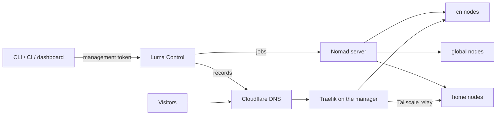

# Concepts

Luma turns a few servers into one deployment platform. Five ideas explain almost everything it does: **node**, **region**, **exposure**, **egress** and **service**.

## How the pieces fit



- **Luma Control** runs on the manager. It authenticates clients, stores cluster state in SQLite, renders Nomad jobs, manages DNS and routes, and dispatches work to node agents.
- **Nomad** schedules containers. The manager runs the Nomad server; every other node is a Nomad client running the Docker driver.
- **Traefik** on the manager receives public HTTP(S) and TCP traffic.
- **Node agents** run on every node. They poll Control for work (install, update, volume preparation, image builds, terminals); Control never connects to nodes directly.
- **Tailscale** connects private and home nodes and carries `tailscale-relay` traffic. It is optional for a single cloud manager.

Deploying and serving are separate paths: clients talk to Control, visitors talk to Traefik.

## Node

A machine that runs Luma. The first one is created with `luma bootstrap`; every other one joins itself with `luma node join`. No machine needs SSH access to another.

```bash
luma node join https://luma.example.com --token <node-join-token> --region global --name sg-1
```

The join writes Nomad client metadata that scheduling relies on:

| Metadata | Set from | Used for |
| --- | --- | --- |
| `region` | `--region` | The service's `region` constraint |
| `luma_node_name` | `--name` | Pinning a service with `node:` |
| `ingress`, `egress` | node roles | Placing Traefik and the egress proxy |

The Nomad node identity is a stable UUID, so a machine that rejoins under the same name keeps its pinned services valid. Metadata is maintained by Luma; do not edit it by hand. Inspect it on the manager with `nomad node status -verbose <node-id>`.

## Region

**Where a service may run.** A node belongs to exactly one region; a service with `region: cn` is only scheduled on `cn` nodes, and `replicas` spread across the ready nodes of that region.

| Region | Intended for | Allowed public exposure | Join and image-pull egress |
| --- | --- | --- | --- |
| `cn` | Public web/API services, databases, Control | `cn-edge` | Through the manager proxy |
| `global` | Workers and services that need the open internet | `external-edge` | Direct |
| `home` | Home servers, NAS, backups, internal tools | `tailscale-relay` | Through the manager proxy |
| custom | Anything, created with `luma region create NAME --egress proxy\|direct` | `none` by default | As configured |

Home networks are less reliable than cloud servers, so keep core public services out of `home`. Prefer queues over real-time calls between regions.

Set `node: <name>` in a manifest only when a service must stay on one machine (local disk, hardware). The region constraint still applies, so the node must be in that region.

## Exposure

**How traffic reaches a service.** It is independent of region, but each public mode requires a matching region.

| Exposure | Path |
| --- | --- |
| `cn-edge` | Cloudflare DNS → Traefik on the manager → service in `cn` |
| `external-edge` | Cloudflare DNS → a global edge → service in `global` |
| `tailscale-relay` | Cloudflare DNS → Traefik → Tailscale → service on a home node |
| `tcp-relay` | A public TCP port on Traefik → service (for example a database) |
| `cloudflare-tunnel` | Cloudflare Tunnel → private service, bypassing Traefik |
| `none` | No public ingress |

See the [exposure model](exposure-model.md) for every mode's requirements and examples.

## Egress

**How containers reach the outside world.** The optional egress gateway is an outbound proxy on the manager. Nodes in proxied regions use it for joining and image pulls. A service uses it at runtime only when its manifest says `proxy: true`; Luma then injects `HTTP_PROXY`/`HTTPS_PROXY`. Egress never carries inbound traffic, and scheduling still follows `region`. See [Egress gateway](egress-gateway.md).

## Service

**A deployable unit**, described by a small YAML manifest that Control turns into a Nomad job:

```yaml
name: app
image: ghcr.io/acme/app:1.0.0
region: cn
exposure: cn-edge
domain: app.example.com
port: 3000
replicas: 2
```

Multi-container applications use a standard `docker-compose.yml` plus a Luma sidecar; all of their services run together on one node. See [Deploying applications](deploying.md) and the [manifest reference](deployment-yaml.md).

## Networking boundaries

Linux nodes use Docker bridge networking with dynamic host ports, which Traefik discovers from Nomad service tags. macOS nodes (Docker Desktop or OrbStack) use host networking. Management traffic between servers prefers Tailscale; only `tailscale-relay` services send visitor traffic over it.

Nomad agents bind to `0.0.0.0` and advertise their Tailscale address; Luma's firewall rules open the Nomad ports only on `tailscale0`. If a Nomad client loses its connection briefly, its allocations keep running (`max_client_disconnect`) and reconnect afterwards.
