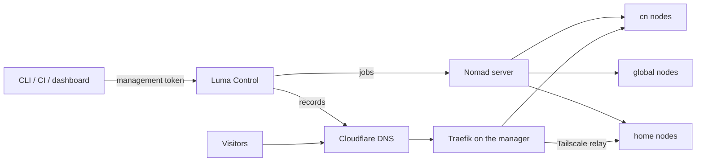

# 核心概念 {#concepts}

Luma 把几台服务器变成一个部署平台。理解五个概念就能理解它的大部分行为：**节点**、**区域**、**暴露方式**、**出站代理**和**服务**。

## 整体结构 {#how-the-pieces-fit}



- **Luma Control** 运行在 Manager 上：认证客户端、用 SQLite 保存集群状态、渲染 Nomad job、管理 DNS 和路由，并向节点 agent 派发任务。
- **Nomad** 负责调度容器。Manager 运行 Nomad server，其余节点都是使用 Docker 驱动的 Nomad client。
- Manager 上的 **Traefik** 接收公网 HTTP(S) 和 TCP 流量。
- 每个节点都运行 **节点 agent**。它向 Control 轮询任务（安装、升级、卷准备、镜像构建、终端）；Control 从不主动连接节点。
- **Tailscale** 连接私网和家庭节点，并承载 `tailscale-relay` 流量。单台云端 Manager 可以不用。

部署路径和访问路径是分开的：客户端和 Control 通信，访问者和 Traefik 通信。

## 节点（Node） {#node}

运行 Luma 的机器。第一台用 `luma bootstrap` 创建，其余机器各自执行 `luma node join` 加入。任何机器都不需要 SSH 到另一台机器。

```bash
luma node join https://luma.example.com --token <node-join-token> --region global --name sg-1
```

加入时会写入调度依赖的 Nomad client 元数据：

| 元数据 | 来源 | 用途 |
| --- | --- | --- |
| `region` | `--region` | 服务的 `region` 约束 |
| `luma_node_name` | `--name` | 用 `node:` 固定服务 |
| `ingress`、`egress` | 节点角色 | 放置 Traefik 和出站代理 |

Nomad 节点身份是稳定的 UUID，同名重新加入后，固定到该节点的服务仍然有效。元数据由 Luma 维护，不要手动修改；需要查看时在 Manager 上执行 `nomad node status -verbose <node-id>`。

## 区域（Region） {#region}

**服务可以运行在哪里。** 每个节点只属于一个区域；`region: cn` 的服务只会调度到 `cn` 节点，`replicas` 会分布到该区域的就绪节点上。

| 区域 | 适合 | 允许的公网暴露方式 | 加入与镜像拉取的出站 |
| --- | --- | --- | --- |
| `cn` | 公开 Web/API、数据库、Control | `cn-edge` | 经 Manager 代理 |
| `global` | 需要访问外网的 worker 和服务 | `external-edge` | 直连 |
| `home` | 家庭服务器、NAS、备份、内部工具 | `tailscale-relay` | 经 Manager 代理 |
| 自定义 | 任意用途，用 `luma region create NAME --egress proxy\|direct` 创建 | 默认 `none` | 按创建时配置 |

家庭网络不如云服务器稳定，核心公网服务不要放在 `home`。跨区域通信优先使用队列，而不是实时 HTTP 调用。

只有服务必须留在某台机器上（本地磁盘、特定硬件）时，才在 manifest 中写 `node: <节点名>`。区域约束仍然生效，所以该节点必须属于同一区域。

## 暴露方式（Exposure） {#exposure}

**流量如何到达服务。** 它和区域是两个独立维度，但每种公网方式都要求匹配的区域。

| 暴露方式 | 路径 |
| --- | --- |
| `cn-edge` | Cloudflare DNS → Manager 上的 Traefik → `cn` 中的服务 |
| `external-edge` | Cloudflare DNS → global 入口 → `global` 中的服务 |
| `tailscale-relay` | Cloudflare DNS → Traefik → Tailscale → 家庭节点上的服务 |
| `tcp-relay` | Traefik 上的公网 TCP 端口 → 服务（例如数据库） |
| `cloudflare-tunnel` | Cloudflare Tunnel → 私网服务，不经过 Traefik |
| `none` | 无公网入口 |

每种方式的要求和示例见[暴露模型](exposure-model.zh-CN.md)。

## 出站代理（Egress） {#egress}

**容器如何访问外部网络。** 可选的出站代理运行在 Manager 上。使用代理的区域在加入集群和拉取镜像时会经过它。服务只有在 manifest 中写 `proxy: true` 时才在运行时使用它，此时 Luma 会注入 `HTTP_PROXY`/`HTTPS_PROXY`。出站代理从不承载入站流量，调度仍然按 `region`。详见[出站代理](egress-gateway.zh-CN.md)。

## 服务（Service） {#service}

**一个可部署单元**，由一份简短的 YAML manifest 描述，Control 会把它转换为 Nomad job：

```yaml
name: app
image: ghcr.io/acme/app:1.0.0
region: cn
exposure: cn-edge
domain: app.example.com
port: 3000
replicas: 2
```

多容器应用使用标准的 `docker-compose.yml` 加一个 Luma sidecar，所有服务一起运行在同一节点上。见[部署应用](deploying.zh-CN.md)和[部署 YAML 参考](deployment-yaml.zh-CN.md)。

## 网络边界 {#networking-boundaries}

Linux 节点使用 Docker bridge 网络和动态宿主机端口，Traefik 通过 Nomad 服务标签发现它们。macOS 节点（Docker Desktop 或 OrbStack）使用 host 网络。服务器之间的管理流量优先走 Tailscale；只有 `tailscale-relay` 服务会让访问流量经过 Tailscale。

Nomad agent 绑定 `0.0.0.0`，对外宣告 Tailscale 地址；Luma 的防火墙规则只在 `tailscale0` 上开放 Nomad 端口。Nomad client 短暂失联时，其上的 allocation 会继续运行（`max_client_disconnect`），恢复后自动重连。
