# 02. 系统架构与基础设施

## 1. 架构边界

```mermaid
flowchart TD
    user["Browser / lae CLI / User Agent"]
    edge["Traefik / LAE Edge"]
    web["lae-web"]
    api["lae-api"]
    agent["lae-agent API / controller"]
    worker["lae-worker / reconciler"]
    db[("PostgreSQL")]
    cache[("Valkey")]
    object[("S3-compatible artifact store")]
    registry[("LAE OCI registry")]
    luma["Luma Control"]
    nomad["Nomad"]
    build["Luma builder pool"]
    runner["lae-agent-runner / BuildKit sandbox"]
    runtime["Isolated tenant runner pool"]
    admin["Luma Dashboard / Superadmin"]

    user --> edge
    edge --> web
    edge --> api
    web --> api
    api --> db
    api --> cache
    api --> object
    api --> agent
    api --> worker
    worker --> db
    worker --> object
    agent --> worker
    worker --> luma
    luma --> build
    build --> runner
    runner --> object
    runner --> registry
    luma --> nomad
    nomad --> runtime
    runtime --> edge
    admin --> luma
    admin --> api
```



### 1.1 信任边界

- Browser/CLI/User Agent 是不可信客户端。
- `lae-api` 是 tenant 认证、授权、配额和审计的唯一公开业务入口。
- `lae-agent` 的公网 API/controller 不直接 clone、挂载源码或持有 Luma credential；它只在完成 tenant 鉴权、配额和审计后创建 analysis operation，由 Worker/Luma adapter 提交任务。
- `lae-agent-runner` 作为不可变镜像在 Luma builder 的隔离 task 中执行，只能读取该 task 的不可变 source snapshot，并输出结构化 evidence/plan；它没有 Luma management token、支付密钥或其他 tenant 凭据。
- `lae-worker` 持有调用 Luma 的内部 service credential；不直接对公网开放。
- Luma Control 仍是集群特权组件；Luma Dashboard 仍是超级管理员工具。
- Luma builder pool 和 runtime pool 都处理不可信输入，必须与 manager、数据库和内网服务隔离；LAE 不能绕开 Luma 自建第二套 Git/build worker。

## 2. 技术栈

### 2.1 Web

| 层 | 选型 | 原因 |
| --- | --- | --- |
| Framework | Next.js App Router + React + TypeScript | 公共站与控制台共存；路由、loading/error boundary、流式渲染和代码分割成熟 |
| Data | TanStack Query | 管理 API cache、重试、后台刷新和 mutation；operation event 另走 SSE |
| Styling | Tailwind CSS theme variables + CSS Modules | 设计 token 集中、定制性强，不被成套 SaaS UI 限制 |
| Primitives | Radix Primitives | dialog、popover、menu、tabs、focus 管理和键盘行为可访问 |
| Motion | Motion for React + 原生 CSS/SVG | shared layout、部署状态转场；模板湖面只用轻量 Canvas/CSS 增强 |
| Icons | Lucide 或自有 SVG 集 | 单一 stroke 体系，不使用 emoji |
| Forms | React Hook Form + schema resolver | 复杂 env/billing 表单、字段级错误和可恢复草稿 |

不直接复用现有 Luma Dashboard 的页面结构；只复用已验证的事件模型、API 思路和个别无特权组件。

### 2.2 API 与业务服务

| 层 | 选型 | 原因 |
| --- | --- | --- |
| API | Python 3.12+、FastAPI、Pydantic | 与现有 Luma Python/Starlette 生态接近，OpenAPI/SSE/JSON Lines/安全依赖成熟 |
| ORM/Migrations | SQLAlchemy 2 + Alembic | 显式事务、PostgreSQL 能力和可审计迁移 |
| Database | PostgreSQL 17，固定 minor/digest | 多租户业务真相、事务配额、outbox、operation lease |
| Queue | PostgreSQL durable queue 为真相；Valkey 仅做唤醒/限流/cache | 避免把任务正确性绑定在易失 cache；MVP 不引入重型工作流平台 |
| Cache | Valkey | rate limit、短期 session/cache、SSE fan-out；丢失后可从 DB 恢复 |
| Object store | S3-compatible API | 上传包、日志 bundle、SBOM、诊断产物、备份；实现可从 MinIO 起步 |
| Observability | OpenTelemetry Collector + Prometheus-compatible metrics + Loki + Grafana | 统一 trace/log/metrics 与 correlation ID |

不使用 FastAPI 的进程内 BackgroundTasks 执行构建/部署；所有长任务进入 durable operation queue。

### 2.3 源码、分析、构建与运行

- 文件上传先进入 artifact quarantine；静态检查完成后，由 Luma builder 用平台固定 Dockerfile 生成受控 OCI image，不运行用户构建脚本。
- Git/模板的 fetch、commit 解析、source snapshot、LAE Agent runner 和 image build 均作为 Luma builder task 执行；LAE API/Worker 只持久化意图、状态、结果和引用。
- 支持框架由 adapter 生成固定 Dockerfile/BuildKit plan；用户 Dockerfile/Compose 也先被 Agent 转换成签名、版本化的 `BuildPlan`，再交给 Luma builder。
- Git/模板来源可以产生单服务计划或 Compose 多服务计划；Compose 是 LAE 的一等 revision 类型。
- Dockerfile 和 Compose 面向所有套餐开放，但所有 lane 都只能使用 rootless BuildKit，禁用 host network、privileged、device 和 insecure entitlement。
- 分析与构建必须消费同一 resolved commit/source snapshot digest；如果 snapshot 变化，原 `DeploymentPlan` 失效，防止分析后换码。
- 生产镜像部署时固定 `sha256` digest，不以 `latest` 作为运行版本。
- MVP runtime 统一 `linux/amd64`，避免在当前节点池中引入跨架构不确定性。

目标 builder task 分为两个显式动作：

1. `analyze-source`：短期拉取凭据 -> fetch -> resolve commit -> 生成只读 snapshot -> 运行固定 digest 的 network-disabled `lae-agent-runner` -> 生成 build proposal -> analyze executor 在 registry allowlist 内固定 external image digest -> 返回 evidence、`DeploymentPlan`、canonical `BuildPlan` candidate 和各自 digest。
2. `build-plan`：按 `sourceSnapshotId` 读取快照并校验 digest、plan 签名和 policy version -> 构建一个或多个 service -> 扫描/SBOM/provenance -> 推送 tenant/app 命名空间 -> 返回 image digest 集合。

当前 Luma 的 `build-image` 可作为实现起点，但不能让 LAE 把 tenant PAT 写入全局 `gitProviders`，也不能假设仓库自带 Luma sidecar。目标接口必须支持一次性 `credentialLeaseId` 和平台生成的显式多 service build specs。

### 2.4 Compose 兼容模型

LAE 不把任意 Compose 字段原样转交 Luma。Agent 先生成 `NormalizedCompose`，Policy 再生成 `luma.compose.yml`：

- 支持多个 HTTP 服务、`exposure:none` 的内部服务、后台 worker、依赖服务、healthcheck 和命名卷。
- 支持服务使用外部 image，或在隔离 builder 中分别 build；每个 build 结果固定到 digest。
- 支持受管命名卷；每个卷绑定 tenant/app、storage class、容量、备份策略和生命周期。
- 允许一个 primary HTTP service 使用应用主域名；其他公开 HTTP service 获得独立、稳定的随机域名。
- 服务间通信使用 Luma/Nomad 生成的 Compose 拓扑；Agent 必须验证依赖名、端口和 health ordering。
- 暂不支持 `tcp-relay`、UDP、公网 host port、`network_mode: host`、宿主 bind、Docker socket、`privileged`、device、PID/IPC host、任意 `cap_add` 和外部网络。
- `ports` 不能成为用户指定的 host port；公开入口由 sidecar 的 `services.<name>.port/domain/exposure` 表达。
- Compose 中的 `${ENV}` 只形成环境变量 schema，值由 LAE secret store 注入，不从仓库 `.env` 上传。

保存的 revision 同时包含：原始 source fingerprint、规范化 Compose、生成的 sidecar、每个服务的 image digest、env schema、volume plan 和策略版本。部署依次执行 Luma compose validate/preview、storage check/apply、compose deploy 与公网验证。

当前 Luma `render_compose_job` 会把一个 Compose 的所有 service 渲染成**同一个 Nomad group、同一节点、同一 region 和共享 network namespace**，并把 service name 映射到 `127.0.0.1`。LAE Agent 因此必须额外检查：所有监听端口在整个 app 内唯一、资源总和能被单节点容纳、不能要求逐服务跨节点/跨 region 扩缩容。当前 renderer 也不会把 Compose `depends_on` 变成严格启动顺序；服务必须自行重试依赖，要求严格 one-shot ordering 的拓扑应阻塞或等待 Luma lifecycle 扩展。Compose HA/逐服务 replica 是后续 Luma renderer 能力，不能在 V1 UI 中假装已支持。

当前 Luma Control 已会遍历 sidecar 中所有公开 service，逐个创建 DNS/route 并做公网 probe，因此“Compose 多公网 HTTP”不需要新建另一套路由引擎。LAE 仍需负责每个 route 的稳定域名、配额、逐路由状态，以及在提交 Luma 前补上当前缺失的 app 内端口冲突检查。

## 3. LAE 服务清单

### 3.1 `lae-web`

- 公共站、认证页、用户控制台。
- 不持有 Luma token、Git token、支付私钥或 secret 明文。
- 浏览器只使用 HttpOnly session cookie；所有危险操作需要 CSRF 防护和 re-auth。

### 3.2 `lae-api`

- 用户、tenant、membership、session、deploy token。
- app/source/diagnosis/deployment/operation。
- entitlement、quota reservation、usage ledger、payment。
- Git integration、domain allocation、audit、admin API。
- 对 LAE Agent、Worker 和 Luma adapter 发出受控内部请求。

### 3.3 `lae-agent` 与 `lae-agent-runner`

- `lae-agent` 是公开 Analysis API 背后的 controller：鉴权上下文由 `lae-api` 注入，controller 创建 operation，由 `lae-worker` 通过 Luma adapter 调度 builder task；Agent 不持有 Luma credential。
- `lae-agent-runner` 是固定 digest 的无状态分析镜像，只在 builder sandbox 中读取不可变 source snapshot。
- runner 执行规则化识别、env 证据提取、策略检查并生成 DeploymentPlan 与内部 unsigned BuildPlan proposal；它无网络、无解析器凭据。Luma analyze executor 在受控匿名 resolver 中加入 external `resolvedDigest` 后才生成 canonical candidate；可信 controller 校验 candidate 后签名。runner 不持有签名密钥，也不直接部署。
- 可选 LLM 只生成解释，不改变 `deployable` 结论，也不获得源码，除非后续有单独的用户同意策略。

### 3.4 `lae-worker`

- 领取 operation lease，带 heartbeat 执行步骤。
- 编排上传校验、Luma builder 的 fetch/analyze/build/scan task、manifest、Luma deploy 和 verify；不在 worker 容器本地 clone/build 用户代码。
- 定时 update check、GC、邮件、usage rollup、支付 reconciliation。
- 每个步骤幂等；进程退出后其他 worker 可从 checkpoint 接管。

### 3.5 `lae-luma-adapter`

可先作为 worker 内部 package，接口独立：

- `preview(manifest)`
- `analyze_source(source_ref, credential_lease_id, policy_version)`
- `build_plan(source_snapshot_digest, signed_build_plan, credential_lease_id)`
- `watch_builder_task(task_id, cursor)`
- `cancel_builder_task(task_id)`
- `deploy(manifest, secrets, idempotency_key)`
- `watch(operation)`
- `runtime_status(luma_slug)`
- `logs(luma_slug, cursor)`
- `restart(luma_slug)`
- `rollback(luma_slug, version)`
- `suspend(luma_slug)`
- `resume(luma_slug)`
- `remove(luma_slug)`

Adapter 把 Luma 的 node task 与 deploy `start/ok/fail/done` 事件规范化成 LAE 事件，不把底层节点、Tailscale IP、credential lease 或 management token 回传给租户。

### 3.6 数据服务

- PostgreSQL：业务真相、operation、event、audit、ledger。
- Valkey：短时 cache/限流/fan-out；可随时重建。
- Artifact store：源码包和构建辅助产物。
- OCI registry：最终镜像、按 tenant/app 命名空间和 digest 管理。

### 3.7 观测服务

- OTel Collector 作为 gateway。
- Metrics backend、Loki、Grafana。
- Alertmanager 或等价告警路由。
- 独立 status page 从合成探针和 SLO 数据生成，不读取前端静态“正常”值。

## 4. 全部部署在 Luma 上的拓扑

### 4.1 可立即落地的 MVP 拓扑

当前 Luma 已保证同一个 Compose deployment 内的服务拓扑，但还没有被 LAE 验证过的跨 deployment 私有服务发现契约。为了不虚构内部 DNS，MVP 先使用三个 Luma deployment：

| Deployment | 服务 | 特性 |
| --- | --- | --- |
| `lae-platform` | web、api、worker、agent、postgres、valkey、artifact store | 一个受控 Compose；只公开 web/api，内部依赖共享拓扑；stateful service 使用受管卷 |
| `lae-observability` | otel-collector、metrics、loki、grafana | 与业务故障隔离；严格资源上限 |
| `lae-registry` | OCI registry/registry cache/GC worker | 独立容量和清理周期 |

Luma Control、Nomad、Traefik、egress 和 node agents 仍属于底座 deployment，不并入 LAE Compose。

`lae-platform` 是启动形态，不是最终扩展上限。它需要 pin/constraint 到专用 cn core/stateful 节点，且 PostgreSQL/artifact 必须有独立受管卷和备份。build 和用户 runtime 始终在外部专用 pool，不与该 Compose 共置。

### 4.2 目标生产拓扑

当 Luma 补齐可验证的私有 service discovery 或内部 gateway 后，再把 `lae-platform` 拆为 `lae-core` 与 `lae-data`，并独立扩容 API/worker/agent。跨 deployment 连接必须使用稳定的内部 service identity、TLS/auth、健康检查和重连，不允许把数据库/Object API 暴露到公网，也不允许硬编码会漂移的 allocation IP。

### 4.3 服务端口与暴露

| 服务 | 公开入口 | 内部依赖 | 持久化 |
| --- | --- | --- | --- |
| `lae-web` | `lae.itool.tech` / HTTP | `lae-api` | 无 |
| `lae-api` | `lae-api.itool.tech` / HTTP | PostgreSQL、Valkey、artifact、Agent | 无 |
| `lae-agent` | none | artifact/source snapshot | 无 |
| `lae-worker` | none | PostgreSQL、Valkey、artifact、Luma API | 临时 workspace 不持久化 |
| PostgreSQL | none | 仅 api/worker | 受管卷 + PITR |
| Valkey | none | 仅 api/worker | 可无持久化或 AOF，不能当业务真相 |
| Artifact store | none | api/worker/agent | 受管卷/对象备份 |
| Registry | none（仅 runner/builder 私网） | builder/runner | 受管卷 + GC |
| OTel/metrics/Loki | none | 平台 telemetry | 按 retention 持久化 |
| Grafana | 管理员入口，不对租户直开 | metrics/Loki | 配置卷/DB |

所有内部 endpoint 通过 Luma 生成的网络配置和 secret 注入；文档不固定容器 IP 或 Tailscale IP。

### 4.4 节点池

当前 `cn/global/home` 是地理/网络 region，不足以表达多租户安全边界。需要在 Luma/Nomad node meta 中增加 workload class：

| Pool | 用途 | 最低要求 |
| --- | --- | --- |
| `control` | Luma manager/Traefik/control | 默认不运行用户 workload；只有显式 `runtime` opt-in、正向 allowlist、资源预留和 Nomad plan 同时成立时才可混部 |
| `lae-core` | web/api/agent controller/worker | cn；访问 DB/Luma；不执行或挂载用户代码 |
| `lae-stateful` | PostgreSQL/object/registry | cn；独立磁盘、备份和低抖动 |
| `lae-builder` | Git fetch、Agent runner、镜像构建 | rootless sandbox/BuildKit、临时磁盘、严格 egress；无 control/DB 凭据 |
| `lae-runner` | 用户应用 | cn；无宿主挂载、无管理网、资源硬限额 |
| `observability` | 观测组件 | 只能读 telemetry；租户查询经过 LAE API |

LAE 生成的 Luma manifest 必须由服务端注入 runner constraint，用户不能提交 `node`、`constraints` 或 `labels` 覆盖它。

当前一个 Compose app 的所有服务会原子调度到同一 runner 节点；带 managed volume 的 app 仍使用同 region 可达的 storage class，但不能把其中某个数据库任务单独调度到 stateful node。用户不能选择具体节点。资源既按每个 service 限制，也必须检查整个 group 的 CPU/memory/端口/volume 总和。未来若 Luma 支持跨 group 的私有 service discovery，才可拆分逐服务调度。

#### 4.4.1 Luma 内部 Placement 层

LAE 公共协议只接受 `region: cn | global`。`node`、IP、pool、failure domain、Nomad constraint/affinity 均不属于公共 request/response/event；即使调用方知道底层名称也不能提交。部署前由 Luma Control 基于实时 Luma 注册信息和 Nomad 节点详情生成内部 `luma.lae-placement/v1` 决策：

1. 只保留目标 region 内、Nomad `ready + eligible + non-draining`、Luma node agent 心跳有效、具备 Docker runtime 能力且为 MVP `linux/amd64` 的节点。
2. 排除专用 builder-only 以及 manager/edge/control-plane-only 节点；显式同时标记 runtime 的混合节点才可进入候选集。历史注册可能出现重复 node ID，因此身份解析先要求 Nomad `Meta.luma_node_name`/`Name` 唯一 exact alias，只有名称零命中才使用唯一 node ID fallback；任一层歧义都 fail closed。候选集以 Luma 内部生成的 `${node.unique.id}` regexp constraint 写入 Job，调用方不能覆盖；Nomad 仍在候选集内完成最终容量调度，不由 LAE 硬选节点。
3. 有 managed volume 时校验 NFS storage class、region、storage host/cross-region Tailscale endpoint、允许节点与允许 failure domain；不兼容时在写 secret、准备目录和注册 Job 前失败。
4. 更新已有应用时读取仍在运行的 allocation，把 prior node/failure domain 写成软 affinity；prior node 故障、drain 或失去资格时不硬绑，Nomad 可在其余 volume-compatible 候选中重调度。
5. 对注入内部约束后的完整 Nomad Job 调用 plan API；由 Nomad 按同一 group 的 CPU、memory、端口和当前 allocation 真相给出 feasibility，再执行 register。

完整 candidate node ID/prior affinity 只保存在 Luma Control 的 runtime state 和内部 Job。管理员/审计展示只能使用 `candidateCount`、region、请求资源、stateful/continuity 与不可逆 decision digest，不显示节点、地址、pool 或 failure-domain 值；租户公开投影完全不包含 `placement`。稳定失败码为 `capacity_unavailable`（503，可重试）、`placement_unavailable`（503，可重试）和 `volume_placement_incompatible`（409，需要修复平台 volume/placement 配置）。所有错误消息禁止拼接 Nomad failure dimensions 或节点名称。

这一实现完成的是 placement admission，不等于 runtime isolation 已完成。专用 `lae-runner` 节点、标准 workload-class meta、管理网/metadata egress 阻断、rootless/runtime sandbox、PID/ephemeral-disk 限额和真实故障演练仍是公开上线门槛。

### 4.5 当前集群迁移要求

当前 live 集群不能原样作为公共 LAE 生产池：

- `builder` 在 `home` region，当前 `build-image` 使用 Docker/buildx 共享宿主能力，只适合现有内部构建；不能原样承载公开不可信分析与构建。
- `manager` 是唯一控制面；`aly` 为待删除历史注册。当前 staging 决策允许 manager 显式兼任 runtime，必须先恢复 manager node agent 并写入 `role.runtime=true`。
- 当前用户 workload 多集中在 home，且至少一个节点出现高负载/高内存占用。
- 当前 registry 自动推导 pull host，LAE 上线前需要把 registry host、GC、备份和目标节点 pull 线路配置成显式、可监控状态。
- Staging 平台在 `lab`，平台数据使用 `builder-registry-nfs` 独立 path；租户卷使用单独的 staging runtime storage 定义。这些都不能替代 PostgreSQL/对象存储的生产 HA 设计。

最低新增容量：一个专用 cn builder、至少一个 cn runner、一个 stateful 节点；公开发布前 builder 必须完成隔离改造，公网扩容前 builder/runner 均至少两台以支持队列冗余、滚动发布和节点故障。

## 5. 应用命名与资源映射

LAE 使用外部 UUID/ULID，不让用户名称直接成为底层 job ID：

```text
tenant_id:       ten_01...
app_id:          app_01...
deployment_id:   dep_01...
luma_slug:       lae-<tenant_short>-<app_short>
primary domain:  <128-bit-lowercase-hex>.itool.tech
service domain:  <128-bit-lowercase-hex>.itool.tech
registry path:   lae/<tenant_id>/<app_id>@sha256:<digest>
object prefix:   tenants/<tenant_id>/apps/<app_id>/...
```

所有表、object key、registry path、Nomad metadata、日志 label 和 audit event 都包含 tenant/app/deployment 关联。不同 tenant 的同名 app 不会冲突。

## 6. 域名、DNS 与 TLS

### 6.1 用户应用

- 使用一个 wildcard DNS：`*.itool.tech` 指向 LAE/Luma edge。
- 使用 DNS-01 签发并轮换 wildcard TLS 证书，避免每个随机域名单独申请证书导致速率风险。
- 显式基础设施域名优先于 wildcard；域名 allocator 维护保留字和已存在 DNS 记录。
- 每个 app 的 primary 域名以及 Compose 公开 service 的附加域名创建后稳定，suspend 时不释放，软删除期结束后才进入冷却池。

### 6.2 平台域名

建议：

- `lae.itool.tech`：Web。
- `lae-api.itool.tech`：公开 API/Agent endpoint。
- `lae-status.itool.tech`：状态页。
- 内部 DB、registry、OTLP 不暴露公网。

### 6.3 路由真相

LAE deployment 完成需要四级验证：

1. Luma 接受 manifest。
2. Nomad allocation running 且 readiness passing。
3. Traefik 路由已加载。
4. 公网随机域名返回预期 health/content。

Luma deployment record 的 `active` 不能单独等价为 LAE `healthy`；当前 live 集群已经存在记录 active、workload 实际 dead 的例子。

## 7. 存储与数据流

### 7.1 上传

```text
client -> create upload -> signed upload URL -> object quarantine prefix
       -> finalize -> size/hash/format validation -> immutable source revision
       -> analysis/build -> artifact/image -> retention policy
```

- 大文件不经 `lae-api` 内存转发。
- 上传未 finalize 前不计正式存储，但有临时额度和超时清理。
- ZIP 解压在临时 sandbox；验证路径后才写入 clean prefix。

### 7.2 PostgreSQL

- 单 writer 起步，WAL/PITR 备份到 object store。
- 数据盘使用 Luma managed storage；manifest 明确 storageClass、资源和 node/pool。
- 每日自动备份不是恢复证明，必须周期性在隔离环境做 restore drill。

### 7.3 Artifact 与 Registry

- Artifact store 保存上传 source、builder 生成的不可变 source snapshot/evidence 引用、SBOM、log bundle、export；Git 凭据不随 snapshot 保存。
- OCI registry 保存运行镜像；实际部署只引用 digest。
- usage ledger 记录 logical bytes 与 physical bytes，配额以用户可解释的 logical bytes 为准。
- 每个 app 保留 active、rollback window 和最近 N 个版本；GC 先解除 DB 引用，再清 registry blob。
- 删除/套餐降级不能直接删除当前 active 或唯一 rollback image。

## 8. Luma 需要的最小扩展

### 8.1 MVP 可先适配现有接口

- LAE worker 使用一枚只在 Luma Secret 中保存的 management token。
- 调用 preview、deploy stream、dashboard status/logs、restart、history、rollback、remove。
- Compose 调用 compose preview/stream，并在部署前执行 storage check/apply；LAE 保存原始/规范化 Compose 与生成 sidecar。
- 内部原型可以复用现有 `build-image` 验证 clone -> buildx -> registry -> deploy 链路；该接口不是公共多租户发布的最终安全边界。
- LAE DB 保存完整历史，不依赖 Luma 100/200 条保留上限。

当前 `build-image` 的兼容边界必须作为迁移测试固定下来：clone/build/deploy 耦合且没有 analyze-only/build-only；多 service build 在单 task 内串行；只消费有限的 context/dockerfile/platform/repo 字段；clone 为 shallow 且未完整处理 submodule/LFS；多 build 依赖仓库内已有 Compose sidecar；全预构建 image 的 Compose import 会误判“未返回 image”；进度主要是原始 buildx 输出；部分镜像 push 后后续失败不会立即回收；构建还会推送 mutable `latest`。Builder v2 必须逐项修复或返回显式 blocker，不能静默忽略 Compose/BuildKit 字段，LAE 部署只能引用 OCI digest。

现有 agent 的 systemd/rootful Docker/buildx + host-network builder 形态，以及把 Git token 放入 clone URL/argv 的方式，也必须替换。目标通过 askpass/fd/secret mount 注入凭据，并让 Luma 服务端选择 builder pool；租户请求不得指定具体 node。

### 8.2 公网发布前应补齐

1. **Scoped service credential**：仅允许指定 `lae-*` namespace 和有限 action；替代集群全权 token。
2. **Server-side policy**：拒绝 privileged、host bind、任意 labels/constraints、非 runner pool、非允许 exposure/region。
3. **Per-slug/idempotency lock**：替代全局 `_DEPLOY_LOCK`，允许无冲突应用并发。
4. **Async operation identity**：每次调用带 idempotency key 和外部 operation ID，可查询/replay。
5. **Suspend/resume**：保留 manifest、域名和状态，不等价于 remove。
6. **Builder `analyze-source` action**：在 builder 隔离任务中 fetch/resolve/snapshot，并运行固定 digest 的 `lae-agent-runner`；返回可恢复 task ID、source digest、plan/evidence digest 和事件。
7. **Builder `build-plan` action**：接受平台签名的版本化多 service build specs，不依赖用户仓库包含 Luma manifest/sidecar；输出逐 service immutable image/SBOM/provenance/scan digest。
8. **Snapshot binding**：分析和构建都校验同一个 resolved commit/snapshot digest；任务重试不重新解析浮动 branch。
9. **Ephemeral credential lease**：LAE secret broker 只向某个 task/action/source host 签发一次性 `credentialLeaseId`；Luma 在 node lease 时换取并注入，过期即失效，不写入全局 `gitProviders`、task state 或日志。
10. **Builder sandbox**：rootless、无 Docker socket、只读 runner image、资源/时间/PID/磁盘/egress 限制；workspace 按 task 创建并保证终态清理。
11. **Tenant registry namespace**：由 Luma 服务端注入 `lae/<tenant>/<app>/<service>`，禁止客户端覆盖；push/pull 凭据按 task 和 namespace 收敛。
12. **Encrypted state**：底座仍需保存的 registry/secret 使用 envelope encryption。
13. **Tenant metadata**：deployment/job/event 中保存 tenant/app/deployment ID，但不信任用户提供。
14. **Wildcard DNS mode**：LAE app deploy 不为每个域名重复创建/删除 DNS 记录。
15. **Runtime policy fields**：read-only rootfs、cap drop、no-new-privileges、PID/ephemeral disk/egress policy。
16. **Observed health API**：区分 deployment record、Nomad desired/running、health check、route/public readiness。
17. **Compose policy report**：返回逐服务 image/build、端口、资源、secret、volume、依赖和禁止字段的结构化校验结果；`tcp-relay` 必须在 LAE 和 Luma 两层拒绝。

## 9. 超级管理员集成

不把 LAE 用户表复制进 `control.json`。现有 Luma Dashboard 增加 LAE 页面时：

- 浏览器用 Luma management session 访问 Luma Control。
- Luma Control 使用内部只读 credential 查询 LAE admin API，或管理浏览器直接访问仅内网可达的 admin API。
- 用户/app 页面显示 LAE ID 与 Luma slug、Nomad job、route、image digest 的关联。
- 终端、节点、全局 secret、registry 凭据仍只属于 Luma 管理域。
- 所有跨系统动作写入 LAE audit event 和 Luma operation correlation ID。

## 10. 仓库组织建议

建议新建独立 `lae` 产品仓库，保留本仓库作为 Luma 底座：

```text
lae/
  apps/web
  apps/api
  services/agent
  services/worker
  packages/contracts
  packages/design-system
  packages/luma-adapter
  cli/
  skills/lae/
  deploy/
    docker-compose.yml
    luma.compose.yml
  docs/
```

需要改 Luma 的能力仍在 `infra-stacks` 独立提交，通过契约测试确保版本兼容。LAE 不 fork 或复制 Luma Control 代码。
