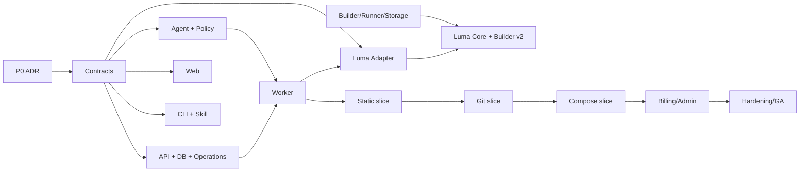

# 06. 分阶段并行研发计划

## 1. 研发方式

LAE 适合按“协议先行、纵向切片、多个小组并发”实施，不适合先分别做一套前端、后端、Agent，最后再对接。

每项功能必须从同一组契约出发：

```text
Product decision / ADR
 -> OpenAPI + JSON Schema + Event Catalog
 -> fake Luma / contract tests
 -> parallel implementation
 -> staging Luma E2E
 -> security + recovery gate
 -> release
```

Web、CLI、Skill 只能消费 API；Agent 只能输出 DeploymentPlan；Worker 只能通过 Luma Adapter 操作 Luma。任何跨层“临时直调”都必须通过 ADR 审查。

## 2. 推荐研发小组

| Workstream | 主要职责 | 主要产物 |
| --- | --- | --- |
| A. Contracts & Architecture | ADR、OpenAPI、JSON Schema、event/error、compatibility | `packages/contracts`、mock server、契约测试 |
| B. Identity & Commerce | 邮件、session、tenant、token、plan、quota、payment | API、migrations、mock provider、audit |
| C. Agent & Adapters | controller、builder runner、detector、env、single/compose plan、policy、diff | `lae-agent`、`lae-agent-runner`、golden repos、plan snapshots |
| D. Build & Runtime Platform | upload、artifact、builder task、rootless BuildKit、registry、runner、volume | Worker、sandbox、BuildPlan、Luma manifests、GC |
| E. Luma Core | `analyze-source`/`build-plan`、credential lease、snapshot、service token、validate、lifecycle、policy | 本仓库 Luma 变更与回归测试 |
| F. Console & Design System | public/auth/console、模板湖面、部署工作台 | Web、tokens、components、a11y/perf tests |
| G. CLI & Skill | machine API、NDJSON resume、credential UX、Skill | `lae` CLI、install/release、Skill |
| H. QA/SRE/Security | E2E、chaos、load、backup、abuse、SLO | test matrix、runbooks、alerts、release gate |

每个 workstream 可并发，但 A 的契约是共同依赖；E 和 D 的安全门槛决定动态/Compose 能否对公众开放。

## 3. 代码仓库与协作

建议：

- `infra-stacks`：继续承载 Luma Core、现有 Dashboard 和 Luma deploy schema。
- 新 `lae` 仓库：Web/API/Agent/Worker/contracts/CLI/Skill/deploy。
- 每个 workstream 独立 branch/worktree；小 PR、可独立回滚。
- Contracts 改动先合并，并生成 TypeScript/Python client/model。
- Luma Adapter 对当前版本和目标版本同时跑 contract tests。
- 所有跨仓变更有同一个 capability ID，例如 `LAE-CAP-compose-v1`。

## 4. Phase 0：决策与底座体检

### 4.1 产品决策

关闭 [07-open-decisions.md](./07-open-decisions.md) 中 P0 问题：ToC 地域、auth、组织、Compose route、volume/backup、AI 源码、计划配额。

### 4.2 当前 Luma 收敛

- 修复 manager node agent missing。
- 明确 builder registryHost/pushHost，并从目标 runner 验证 pull；验证 clone -> build -> push -> runner pull 全链路。
- 把现有 `build-image` 作为迁移基线，设计 Builder v2：`analyze-source`、显式多 service `build-plan`、不可变 snapshot、credential lease、tenant registry namespace、rootless sandbox。
- 备份并验证 `/opt/luma/control/control.json`、Nomad、routes、registry/storage。
- 清点现有 node capacity，新增独立 `lae-builder`、`lae-runner`、`lae-stateful`。
- 不在现有高负载 home node 上承载公开 tenant workload。

### 4.3 ADR

至少产出：

- ADR-001 LAE/Luma trust boundary。
- ADR-002 tenant/user/org 模型。
- ADR-003 email auth/session/deploy token。
- ADR-004 durable operation/outbox/event replay。
- ADR-005 source credential/envelope encryption。
- ADR-006 build/runtime sandbox。
- ADR-007 domain/wildcard TLS。
- ADR-008 Compose allow/deny policy。
- ADR-009 volume/storage/backup/delete semantics。
- ADR-010 quota/payment/usage ledger。
- ADR-011 optional LLM/source privacy。
- ADR-012 Luma builder source/analyze/build task 与 credential lease。

### 4.4 退出条件

- P0 ADR approved。
- 当前集群健康与新增容量方案 approved。
- threat model 和 abuse model reviewed。
- contracts 可开始冻结。

## 5. Phase 1：协议冻结与开发骨架

### 5.1 Contracts

- OpenAPI `/v1`。
- `DeploymentPlan v1`（service + compose union）。
- `BuildPlan v1`（single + multi-service、source snapshot binding、签名）。
- `LumaSourceAnalysisTask v1` / `LumaBuildTask v1` / builder event。
- `OperationEvent v1`。
- public Error v1。
- Luma Adapter internal contract。
- entitlement/usage metrics catalog。

### 5.2 骨架

- PostgreSQL migrations、tenant-aware repository abstraction。
- API/Worker/Agent/Web/CLI 基础工程。
- Outbox + durable operation lease + SSE/NDJSON replay。
- Fake Luma server：analyze/build task、credential lease、preview/deploy events/status/log/restart/rollback/failure injection。
- Luma deployment files：`lae-core/data/registry/observability` 的 dry-run 版本。

### 5.3 退出条件

- TypeScript/Python generated clients 通过 schema compatibility tests。
- operation 在 API/worker 重启后可接管和重放。
- 同 idempotency key 不产生重复 operation。
- 所有服务能在 staging Luma 以空功能启动。

## 6. Phase 2：第一条纵向切片——静态上传

Phase 2 是用于尽早验证整条平台链路的第一个切片，不代表对外 MVP 只发布静态能力。**产品 MVP 的功能退出条件包含 Phase 2、Phase 3 和 Phase 4，Compose 属于 MVP 必选范围。**

并行实现：

- 注册/验证/personal tenant/default token。
- HTML/ZIP presigned upload、quarantine、scan、quota reservation。
- static Agent detector/env/CSP evidence。
- Luma builder 受控静态 OCI image、registry digest。
- 单服务 Luma preview/deploy stream/status/public verify。
- Web 首次部署工作台和真实事件动画。
- CLI `login/inspect/deploy/operation watch/apps list`。
- Lite mock entitlement。

### 6.1 退出条件

- 完整 E2E：注册 -> upload -> inspect -> deploy -> stable domain -> logs -> suspend/resume/delete。
- 浏览器/CLI 断线可续看。
- 重复提交不重复构建/部署/扣配额。
- ZIP 攻击语料稳定拒绝。
- 上一健康版本不被失败更新替换。

## 7. Phase 3：Git 单服务与模板

- GitHub App installation、public/private repository、ref/commit。
- Generic Git/Gitea credential 与 SSRF/submodule policy。
- Vite/Astro/Node/Python/Dockerfile adapter。
- Luma builder `analyze-source`/`build-plan`、rootless sandbox、SBOM/scan/provenance。
- source update check 和 plan diff。
- Template registry、湖面 UI、模板真实 smoke test。
- Lite/Pro/Ultra 的资源限额与 private Git connection 配额；Dockerfile/private Git 部署能力不采用邀请制 feature flag。

### 7.1 退出条件

- public/private Git 凭据只在 lease 中出现，DB ciphertext 可轮换。
- analysis 与 build 始终命中同一 resolved commit/snapshot digest；branch 前移必须产生新 analysis。
- golden repos build/deploy/rollback 通过。
- 动态服务不能访问 control/metadata/private network。
- builder task/node crash 后 operation 可接管，workspace/credential lease/quota 可清理。

## 8. Phase 4：Compose 一等支持

Compose 不是后置增强或实验性 YAML 输入，而是 MVP 的完整产品切片：

- Compose detector、规范化、dependency topology。
- 多 build 并行、逐 service image digest。
- LAE 生成显式多 service BuildPlan，Luma builder 不依赖仓库包含 Luma sidecar。
- primary/additional HTTP route 与稳定随机域名。
- internal service、worker、datastore。
- named volume allocation、storage check/apply、backup/delete policy。
- Compose env schema、逐服务 logs/metrics/status。
- topology UI、部署支流动画、逐 route verify。
- application/revision/deployment/rollback/suspend/resume 的 Compose 语义。
- Luma 与 LAE 两层明确拒绝 `tcp-relay`/TCP/UDP/host port。

### 8.1 必测样本

- web + worker。
- web + Postgres + named volume。
- two HTTP services + two stable domains。
- multiple Dockerfiles/build contexts。
- 只有标准 `compose.yaml`、仓库完全不含 Luma manifest/sidecar。
- 全预构建 image 的 Compose（零 build）可直接固定 digest 并部署。
- build args/target/secret mount，未支持的 SSH/cache/additional context 明确阻塞。
- depends_on/health failure。
- 重复内部端口、第二个 image build/push 失败与 orphan GC。
- shallow/submodule/LFS 的明确支持或拒绝策略。
- volume init/retain/restore。
- privileged/host-network/docker.sock/host-bind/tcp-relay deny。

### 8.2 退出条件

- plan/normalized Compose/sidecar 的 digest 可复现。
- 每个 service/route/volume 正确计配额。
- Compose build/deploy 中任一失败可从安全 checkpoint 重试。
- fetch/每个 service build/push/scan/digest 都有结构化、可重放事件；不能只解析 buildx 文本。
- builder task cancel/retry、事件 cursor resume 和同一 idempotency key 不重复执行。
- rollback 不宣称回滚数据库/volume 数据。
- delete/suspend 不误删 retained volume。

## 9. Phase 5：生命周期、计费与超级管理员

- Luma 原生 scoped service credential、externalRef/idempotency。
- Luma/LAE suspend/resume、single application/service observed state。
- Secret replace/delete/cleanup 和 encrypted/ephemeral injection。
- Lite/Pro/Ultra 硬配额、usage ledger、downgrade behavior。
- Mock payment 全链路；微信/支付宝 adapter、webhook/reconcile/refund。
- Luma Dashboard LAE admin section。
- abuse/report/suspend/appeal。
- Status page、SLO、alert/runbooks。

### 9.1 退出条件

- 支付 replay/out-of-order/mismatch 测试通过。
- 超管动作不绕过 LAE audit/quota 状态机。
- over-quota 不丢数据且限制行为符合文档。
- cross-tenant authorization suite 零泄漏。

## 10. Phase 6：公开 Beta / GA Hardening

- 多 runner/Luma builder 容量、队列与调度。
- Luma per-slug concurrency，去除公共部署的全局串行瓶颈。
- load/soak/chaos：DB failover、worker kill、Luma disconnect、registry full、route failure。
- backup/PITR/volume restore/registry restore 演练。
- security review、dependency/image scan、penetration test。
- ICP/隐私/条款/内容治理/支付主体确认。
- 发布 beta SLA、限制和 status page。

GA 需要真实数据证明支持范围部署成功率和故障恢复，不按功能列表数量判断。

## 11. 依赖图



Compose 开发可在 static/Git slice 期间并行，但公开验收依赖 build/runtime/volume/Luma policy 完成。

## 12. CI 与测试门禁

### 12.1 每个 PR

- format/lint/typecheck/unit。
- OpenAPI/JSON Schema backward compatibility。
- migration upgrade/downgrade 或 forward-only verification。
- secret/log snapshot redaction。
- Agent golden plan snapshot。
- Luma fake contract。
- Web accessibility component tests。

### 12.2 Merge Gate

- API integration + PostgreSQL。
- operation crash/retry/idempotency。
- tenant authorization matrix。
- Luma preview/dry-run。
- upload/Git security corpus。

### 12.3 Release Gate

- staging Luma 真部署：static、single service、Compose+volume、multi-route。
- update/failed update/rollback/suspend/resume/delete。
- public route + runtime observed state 对账。
- backup/restore smoke。
- a11y、reduced motion、375/768/1024/1440。
- load/capacity budget。

## 13. Definition of Done

每个 capability 必须同时具备：

- Approved ADR/contract。
- 用户路径与失败路径。
- API auth/quota/idempotency/audit。
- Web/CLI/Skill 至少一个机器可验收路径。
- unit/contract/integration/E2E。
- metrics/logs/trace/alert。
- migration/rollback/cleanup。
- docs/runbook。
- staging Luma 真验证。

“本地返回 200”或“Dashboard 显示 active”不能单独作为完成依据。

## 14. 第一批可执行 Epic

1. `LAE-FOUNDATION`：repo、contracts、DB、operation/outbox、fake Luma。
2. `LAE-IDENTITY`：email auth、tenant、session、deploy token。
3. `LAE-UPLOAD`：artifact store、presigned upload、scanner、quota。
4. `LAE-STATIC`：static adapter/image/deploy/verify。
5. `LAE-GIT`：GitHub App、generic Git、source revision。
6. `LAE-BUILDER`：rootless sandbox、registry、SBOM/scan。
7. `LAE-COMPOSE`：normalize/topology/sidecar/multi-build。
8. `LAE-VOLUME`：allocation/backup/retain/restore/usage。
9. `LAE-CONSOLE`：design system、deploy workspace、apps/services/routes/volumes。
10. `LAE-CLI-SKILL`：login/inspect/deploy/watch/lifecycle/payment link。
11. `LUMA-LAE-BRIDGE`：service token/idempotency/metadata/validate/status/suspend。
12. `LAE-BILLING`：plans/quota/ledger/mock/WeChat/Alipay。
13. `LAE-ADMIN-OPS`：Luma admin integration、audit、abuse、SLO、DR。

Epic 内按 vertical acceptance 拆 issue，避免按“先写完所有表/所有页面”横向堆积。
