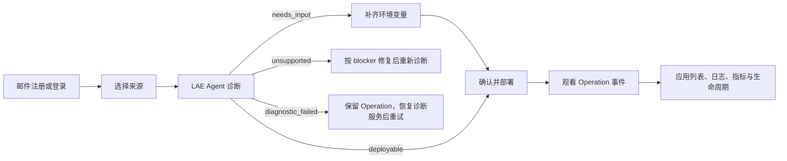

# 09. LAE 用户使用指南

> 文档版本：2026-07-15<br>
> 适用对象：LAE Web 用户、`lae` CLI 用户，以及代表用户调用 CLI 的 AI Agent<br>
> 发布状态：代码能力说明，不代表生产 GA。真实可用性以 [实施状态与验收证据](./08-implementation-status.md) 和平台状态页为准。

## 1. 先理解三个边界

1. **LAE 是用户入口，Luma 是内部执行底座。** 用户、CLI 和用户自己的 Agent 只调用 LAE，不能也不需要取得 Luma management token。
2. **用户选择 region，不选择机器。** LAE 当前运行协议接受 `cn` 或 `global`；具体 Luma/Nomad 节点、节点名、IP、候选池和故障域由平台内部 placement 决定，不进入租户响应、日志或工单。应用不能依赖固定节点 IP。
3. **公网只开放 HTTP/HTTPS。** 一个 Compose 应用可以有多个公网 HTTP 服务，每个服务获得独立且稳定的随机 `*.itool.tech` 域名；V1 不支持自定义域名、公开 TCP/UDP、`tcp-relay` 或 host port。

当前实现状态使用以下词汇：

| 标记 | 含义 |
| --- | --- |
| 已实现 | API/Worker/Web 或 CLI 代码和自动化测试已存在 |
| 已部署到 staging | 已完成真实 Luma import/build/service registration，但不自动代表用户路径验收通过 |
| 待 staging 验证 | 已有代码或真实部署，尚未在隔离 Luma staging 完成相应端到端、故障和安全验证 |
| 发布门禁 | 未满足时不得向生产用户承诺可用 |

截至 2026-07-15，Luma `v0.1.257` 已发布到 Control/manager 与在线节点 `bot/builder/lab/m4/tecent`；`gaojiu` 离线、`blg` 按要求未触碰、`aly` 为历史节点。LAE staging 运行 exact ref `6c718c61b2dae421078c92a2b2542d6a9b2e960c`（Nomad v10），10 个 LAE service 与 Web/API/Agent/artifact 基础探针健康。四服务 Compose 已走通 Agent 诊断、必需环境配置、Builder 构建、首次冷拉、双公网 HTTPS route、双持久卷、restart、suspend/resume、更新检查与明确 unsupported blocker；stateful rollback checkpoint、长部署阻塞 Worker 队列、运行时已不存在时删除失败及历史裸域证书阻止 wildcard TLS 的问题已在本次基线修复。新的 wildcard 证书仍受 Let's Encrypt 周限额窗口约束，须在限额释放后完成最终签发验收。preview 不代表真实邮箱送达，进程恢复也不代表 PITR/备份还原；因此本指南仍是 staging 使用说明，不是生产 GA 承诺。

## 2. 支持什么

| 来源或能力 | 用户输入 | 当前产品语义 |
| --- | --- | --- |
| 单 HTML | 一个 `.html` 文件 | 作为静态站点部署；文件内容必须确实是 HTML |
| 静态 ZIP | 一个已构建的 `.zip` | 根目录必须有 `index.html`；会检查路径穿越、链接/设备文件、压缩炸弹、文件数和大小 |
| 公有 Git | 无凭据的 HTTPS 仓库 URL + ref | Luma Builder 拉取、固定完整 commit、分析并构建 |
| 私有 Git | HTTPS 仓库 + LAE source connection | 凭据加密保存，Builder 通过任务绑定的一次性 lease 获取；URL 中不能嵌入凭据 |
| Dockerfile | 放在 Git 仓库中 | Lite/Pro/Ultra 均可分析；必须通过构建与运行安全策略 |
| Docker Compose | 标准 Compose 放在 Git 仓库中 | 支持多个 HTTP 服务、内部服务、worker、datastore 和受管 named volume |
| 模板 | 选择固定版本的模板 | 仍走创建应用、LAE Agent 诊断、配置和部署流程，不绕过策略 |
| 环境变量 | 名称、作用服务和值 | 诊断只返回名称和敏感性；值加密保存，不回显 |
| 生命周期 | 更新检查、暂停、恢复、重启、回滚、删除 | 通过持久 Operation 执行；更新检查返回 source tree/DeploymentPlan 结构化比较，失败不能覆盖上一健康版本 |
| 运行观测 | 逐服务日志和近期指标 | Web 与 CLI 使用租户边界后的 LAE API，不直接读取 Nomad |

上传 API 的绝对协议上限是 512 MiB；套餐配额可以更低，以服务端返回为准。大于配额的请求会在上传前拒绝，不要拆包绕过。

## 3. 标准流程



用户不需要也不能编写 Luma 文件。LAE Agent 在 Luma Builder 中读取不可变源码快照，先生成确定性拓扑与安全证据，再把脱敏、限量的结构化信息交给配置好的模型；模型结合版本化 LAE Knowledge Pack 生成部署提案。平台随后以确定性 schema、语义和安全策略终审，保存与应用 revision 绑定的 DeploymentPlan、BuildPlan、manifest candidate 和最终 Luma manifest。

公开 verdict 有四种：

- `deployable`：当前不可变源码快照和计划可以进入部署。
- `needs_input`：拓扑受支持，但缺少必需环境变量；补齐后再进入部署。
- `unsupported`：存在确定性策略 blocker。界面/CLI 会返回稳定 code、证据路径/字段和可执行修复建议；修复源码或 Compose 后创建新的 analysis，不能手改 LAE 生成的 Luma 文件。
- `diagnostic_failed`：模型、controller、Builder 或诊断协议失败，不能据此断言用户代码不支持；保留 Operation/request ID，恢复诊断链路后安全重试。

分析、构建、部署和生命周期都是异步 Operation。请保留 `operationId` 和最新 `cursor`；浏览器关闭或 CLI 断线后应续看原 Operation，而不是重复创建任务。

## 4. Web 控制台

### 4.1 邮件注册和登录

1. 打开 LAE，进入“注册或登录”。
2. Production 选择“注册”或“登录”并输入真实邮箱；启用 preview mode 的 staging 会明确显示 `STAGING PREVIEW`，直接点击“进入预览空间”，无需提交个人邮箱。
3. 真实邮件模式在邮箱中使用六位验证码或一次性链接；preview mode 只为保留的 `.invalid` 测试账号签发短时凭据并自动交换 Session。链接中的凭据会在页面加载后从地址栏移除。
4. 注册成功后，平台自动创建 personal tenant、Lite entitlement 和默认 deploy token。
5. **默认 deploy token 只显示一次。** 立即复制到本机的安全凭据存储；不要粘贴到聊天、Issue、Git、截图或 shell history。

公开 preview 入口只允许保留的 `.invalid` 测试身份，不能查询普通邮箱验证码。普通邮箱注册必须由配置的 SMTP/API provider 实际投递；生产开放注册前必须通过真实收件 canary、发件域 SPF/DKIM/DMARC、退信和送达率验收。

登录建立 HttpOnly Session。正常再次登录不会重新显示已有 token。默认 token 仅首次展示；账户页已经支持查看 token metadata、新建、轮换和撤销。轮换或撤销会立即影响后续 CLI/Agent 请求，操作前确认没有仍在使用旧 token 的自动化。

### 4.2 从模板开始

部署页由一个连续的部署工作台和下方的模板起步区组成。工作台左侧固定显示
“来源 → 诊断 → 配置 → 部署 → 上线”五个阶段，中间只展示当前阶段需要处理的
内容，右侧持续显示来源、revision、环境和路由等部署合同与证据；不会把后续表单
提前堆在同一页。模板区使用与 Luma Dashboard 一致的纯白画布和四列起步项，
点击模板即直接进入诊断，不需要先选中再点第二次按钮。随后平台会：

1. 创建一个新应用和稳定随机域名；
2. 绑定模板固定的 Git 来源；
3. 启动正常 LAE Agent 诊断；
4. 如果缺少环境变量，进入配置表单；
5. 只有诊断通过后才允许部署。

当前目录包含 Next.js、FastAPI、Flask 和 Express 类型的固定版本模板。每个模板都固定到完整 Git commit，并走与普通用户相同的诊断、构建、运行和 HTTPS 探测。平台每日自动验收：连续三次失败会暂时从目录隐藏，后续验收成功自动恢复。普通用户不会看到内部失败计数或 smoke 凭据。

### 4.3 公有 GitHub / HTTPS Git

1. 选择“GitHub 仓库”。
2. 输入应用名称、slug、无凭据的 HTTPS 仓库 URL、Git ref 和可选子目录。
3. 提交诊断。

仓库 URL 必须类似 `https://github.com/owner/repository.git`，不能包含用户名、token、query、fragment、localhost、私网 IP 或内部域名。ref 可以是分支的完整 ref；Builder 会把本次诊断固定到实际完整 commit。更新检查会基于应用保存的浮动 ref 创建新的不可变快照。

### 4.4 私有 Git

如果还没有连接：

1. 选择“私有 Git”，展开“配置私有 Git 凭据”。
2. 选择 GitHub、Gitea 或 Generic Git HTTPS。
3. 输入显示名称、Git 服务根地址、可选用户名和只读 token。
4. 保存连接，再选择该连接和仓库进行诊断。

凭据不写进仓库 URL、部署计划、Luma state、Builder argv 或用户日志。连接 metadata 可以列出；secret 不会回显。轮换后使用新凭据，新任务 lease 不再使用旧值；撤销前要确认没有仍需该连接的更新任务。

### 4.5 HTML / ZIP 上传

1. 选择“静态产物”。
2. 选择一个普通、非 symlink 的 `.html` 或 `.zip` 文件。
3. 输入应用名称和 slug，开始诊断。

浏览器会先预约存储，再把文件上传到一次性签名 URL。LAE 随后复核 media type、大小和 SHA-256，并执行安全扫描。签名 URL、请求头和对象 key 不会显示给用户，也不能拿到另一个工具中重放。

本地源码需要执行 `npm run build`、`vite build` 等步骤时，不要直接压缩源码上传；应提交到 Git，由 Luma Builder 构建。ZIP 只用于已经打包完成的静态产物。

### 4.6 环境变量

诊断发现配置后，Web 会显示变量名称、是否必需、是否敏感及使用它的 service。值的处理规则：

- token、password、secret、key、credential 类名称默认视为敏感；
- 敏感值输入后不再回显；
- 可以追加 Agent 未识别出的变量；
- 修改使用 compare-and-set 版本，旧页面提交会被拒绝，刷新后再操作；
- 一个值确实需要供多个 service 共享时才使用全局作用域，否则按 service 分别设置。

缺少必需变量时不能部署。环境变量更新不会自动改变已运行 revision；需要明确创建新的 deployment。

### 4.7 部署和进度

诊断通过后确认部署。界面的阶段动画来自真实 Operation 事件，而不是定时演示：source snapshot、analysis、build、image verification、volume preparation、runtime placement、route verification 和 terminal state 会逐步更新。

只有同时满足以下条件才算成功：

- Operation 为 `succeeded`；
- 所有必需 service 运行正常；
- 每条公网 HTTP route 通过验证；
- 应用详情指向新 deployment。

构建或验证失败时，上一健康 deployment 保持运行。不要因为短暂 `pending` 或切换时的单次 502 立即重复部署；先查看 Operation 最终状态和路由验证结果。

### 4.8 应用列表、日志和指标

应用列表采用连续的运行台账，不使用互相割裂的大卡片。每行把应用名称、产品级
状态、service/route 数量、稳定域名、desired state 和最近更新时间放在同一阅读
路径中；高频动作位于行尾，低频或危险动作收进更多菜单。应用的物理节点名与 IP
不显示；底层节点可能因容量、维护或故障发生变化。

当前 Web 已实现：

- 暂停/恢复；
- 重启；
- 主动检查 Git 更新；
- 更新检查完成后区分无可用基线、无变化、仅源码变化、仅部署计划变化或两者均变化；
- 查询 deployment history，并在存在上一条 succeeded deployment 时提供回滚；
- 删除应用，确认框明确说明持久卷默认保留；
- 打开观测抽屉，查看受限的逐服务日志尾部和近期指标。

回滚和删除都会先打开包含目标与影响说明的 `alertdialog`，必须显式确认；Escape 可以关闭，reduced-motion 模式不会依赖大幅动画传递状态。回滚不会让用户选择任意 Luma version，只允许应用历史中上一条 succeeded deployment。Web/API/CLI 已有完整入口，但在真实 staging 生命周期执行通过前仍不应当作为生产承诺。

## 5. CLI

### 5.1 安装和环境

正式发行后，安装包名为 `lae-cli`，命令名为 `lae`。当前仓库开发环境可从 workspace 运行：

```bash
REPO_ROOT=/absolute/path/to/infra-stacks
cd "$REPO_ROOT/lae"
uv run --package lae-cli lae --format json version
```

生产 API 默认是 `https://lae-api.itool.tech/v1`。访问当前 staging 时必须显式设置完整 `/v1` 地址：

```bash
export LAE_API_URL=https://lae-staging.itool.tech/v1
```

不要把 deploy token 放在命令参数中。交互式终端可以安全读入当前 shell：

```bash
read -r -s LAE_DEPLOY_TOKEN
export LAE_DEPLOY_TOKEN
lae --format json doctor
lae --format json login
lae --format json whoami
```

`lae login` 只验证 token，故意不把明文持久化。也可以使用 `lae login --token-stdin` 交互输入；当 Git secret 或环境变量值需要占用 stdin 时，deploy token 必须来自 `LAE_DEPLOY_TOKEN`。

`doctor` 只检查本机 API URL、认证是否已配置和 contracts，不代表服务端健康；`login`/`whoami` 成功才证明当前网络和 token 可用。

### 5.2 幂等键

每个写操作都需要显式 idempotency key。规则是：

- 为一次逻辑请求生成稳定键，并和 `operationId/cursor` 一起保存；
- 网络失败后，只有 method、route 和 body 完全相同时才复用该键；
- body、文件、应用或目标变化时必须换新键；
- 不要把随机重试写成无限循环。

下文的 `<...>` 都是占位符，执行前替换；不要原样复用示例键。

### 5.3 创建应用并诊断公有 Git

```bash
lae apps create \
  --name <display-name> \
  --slug <lowercase-slug> \
  --idempotency-key <create-key> \
  --format json

lae inspect \
  --app <app-id> \
  --repo <credential-free-https-repository> \
  --ref <git-ref-or-commit> \
  --idempotency-key <analysis-key> \
  --format ndjson
```

需要稍后查看时可加 `--no-wait`；保存返回的 Operation ID，再用 `operation watch` 续看。

### 5.4 配置私有 Git

下面的命令会在 TTY 中隐藏提示并读取 Git secret：

```bash
lae source-connections create \
  --provider <github|gitea|generic> \
  --name <connection-name> \
  --base-url <credential-free-https-base-url> \
  --username <optional-username> \
  --secret-stdin \
  --idempotency-key <connection-key> \
  --format json

lae inspect \
  --app <app-id> \
  --repo <credential-free-https-repository> \
  --ref <git-ref-or-commit> \
  --connection-id <connection-id> \
  --idempotency-key <analysis-key> \
  --format ndjson
```

管理连接：

```bash
lae source-connections list --format json
lae source-connections rotate <connection-id> --secret-stdin \
  --idempotency-key <rotate-key> --format json
lae source-connections revoke <connection-id> \
  --idempotency-key <revoke-key> --format json
```

撤销是有影响的操作，必须由用户确认。

### 5.5 诊断本地 HTML / ZIP

先创建应用，然后运行组合命令：

```bash
lae inspect-file \
  --app <app-id> \
  --file <artifact.html|artifact.zip> \
  --idempotency-prefix <stable-upload-prefix> \
  --format ndjson
```

该命令完成预约、一次性 PUT、服务端校验、扫描和 analysis 创建。超时并不等于文件丢失；保留 `uploadId`，使用以下命令检查或清理：

```bash
lae uploads show <upload-id> --format json
lae uploads delete <upload-id> --idempotency-key <delete-key> --format json
```

### 5.6 模板

```bash
lae templates list --format json
lae templates launch <template-id> \
  --name <display-name> \
  --slug <lowercase-slug> \
  --wait \
  --idempotency-key <launch-key> \
  --format ndjson
```

返回 verdict `needs_input`（底层 analysis status 为 `needs_configuration`）时，退出码为 4；这不是模板构建失败，应按下一节补配置。

### 5.7 补齐环境变量

```bash
lae config show --app <app-id> --analysis <analysis-id> --format json
lae env list <app-id> --format json
```

从 `env list` 读取当前 `version`。设置值时 CLI 会在 TTY 中隐藏输入：

```bash
lae env set <app-id> <NAME> \
  --service <service-key-or-*> \
  --expected-version <version> \
  --value-stdin \
  --idempotency-key <env-key> \
  --format json
```

每次修改后版本会递增；设置下一个值前重新获取版本。删除变量：

```bash
lae env unset <app-id> <NAME> \
  --service <service-key-or-*> \
  --expected-version <version> \
  --idempotency-key <unset-key> \
  --format json
```

### 5.8 部署、断线续看和取消

```bash
lae deploy \
  --app <app-id> \
  --analysis <analysis-id> \
  --environment-version <version> \
  --wait \
  --idempotency-key <deploy-key> \
  --format ndjson
```

断线续看：

```bash
lae operation show <operation-id> --format json
lae operation watch <operation-id> --after <last-cursor> --format ndjson
```

取消只请求停止，不代表底层任务已立即终止；继续观看到终态：

```bash
lae operation cancel <operation-id> \
  --idempotency-key <cancel-key> \
  --format json
lae operation watch <operation-id> --after <last-cursor> --format ndjson
```

### 5.9 应用操作

```bash
lae apps list --format json
lae apps show <app-id> --format json
lae apps deployments <app-id> --limit 20 --format json

lae apps check-update <app-id> --idempotency-key <update-key> --format json
lae apps suspend <app-id> --idempotency-key <suspend-key> --format json
lae apps resume <app-id> --idempotency-key <resume-key> --format json
lae apps restart <app-id> --idempotency-key <restart-key> --format json
lae apps rollback <app-id> --deployment <deployment-id> \
  --idempotency-key <rollback-key> --format json
lae apps delete <app-id> --yes \
  --idempotency-key <delete-key> --format json
```

`apps deployments` 返回服务端权威的有界部署历史；回滚目标必须从这里选择，不能从日志猜测。每个动作返回新的 Operation，随后用 `lae operation watch` 观看。回滚和删除必须先展示目标 deployment、环境/route/volume 差异并取得人工确认。删除默认保留受管 volume；数据删除需要独立、明确且可审计的策略，不能从 CLI 的普通删除动作推导。

当前 V1 回滚只允许 service/route/volume binding 拓扑与应用 catalog 兼容的历史 deployment；拓扑不一致会 fail closed，不能用回滚绕过新的诊断和部署流程。取消发生在 Runtime mutation 提交前时会恢复原 desired state；提交后再取消可能已经太晚，最终以同一个 Operation 的 Runtime 结果为准。

### 5.10 日志和指标

```bash
lae apps logs <app-id> --service <service-key> --tail 120 --format json
lae apps metrics <app-id> --service <service-key> --window 3600 --format json
```

日志尾部限制为 1–500 行；指标窗口限制为 60–604800 秒。LAE 会做权限过滤、大小限制和基础脱敏，但应用仍不应主动打印 secret。

### 5.11 套餐与 mock checkout

注册时生成的默认 deploy token **故意不含** `billing:checkout`。下面的 CLI 命令只适用于用户通过账户页创建的、显式包含该 scope 的独立 token；账户页已经提供 token CRUD、套餐/订阅/用量视图和 mock checkout 跳转。不要为了方便给默认 token 扩权。

```bash
lae plans list --format json
lae billing checkout \
  --plan <pro|ultra> \
  --interval <month|year> \
  --idempotency-key <checkout-key> \
  --format json
```

Lite 是注册后的默认免费 entitlement，不需要购买。支付 provider 由服务端选择，客户端不能提交或强制 `mock`；当前 mock 只允许 dev/staging。用户必须自己打开 checkout URL 并确认，Agent 不得替用户完成支付。生产当前使用 `disabled` driver，微信/支付宝真实 adapter、退款和 provider sandbox 通过前，付费端点应返回不可用而不是伪成功。

### 5.12 CLI 退出码

| 退出码 | 含义 | 下一步 |
| ---: | --- | --- |
| 0 | 成功 | 继续 |
| 2 | 本地参数无效 | 修正输入，不原样重试 |
| 3 | 未认证或无权限 | 在本机配置/轮换 token |
| 4 | 需要用户配置 | 补齐返回的变量名称 |
| 5 | 不支持或策略拒绝 | 修复 blocker；不要绕过 |
| 6 | 套餐或配额不足 | 查看用量和计划；不要自动升级 |
| 7 | source/build/analysis 失败 | 保留 operation/analysis，查看安全 evidence |
| 8 | deploy/runtime 验证失败 | 保留上一健康版本，按 SOP 排查 |
| 9 | 可重试的平台故障 | 使用同一幂等身份和 cursor 恢复 |

## 6. 给 AI Agent 使用的 Skill

仓库内 Skill 位于 [`lae/skills/lae-deploy`](../../lae/skills/lae-deploy/)。它覆盖能力检查、认证、Git/文件诊断、环境变量、部署、续看、应用操作和支付的人机边界。

推荐给 Agent 的指令是：

```text
使用 lae-deploy skill 部署这个应用。先做 capability/doctor/whoami，
再 inspect；只在结果为 deployable 时部署。任何 deploy token、Git secret、
环境变量值、验证码和支付确认都由我在本机输入，不要在对话中索取。
```

Agent 必须遵守：

- 只调用 `lae`，不调用 Luma management API；
- 不在 argv、prompt、日志或仓库中传 secret；
- `needs_input` 时只向用户说明变量名称和原因；
- `unsupported` 时明确逐项展示 blocker、证据位置和修复建议，然后停止，不手改平台生成的 manifest；
- `diagnostic_failed` 时说明这是平台诊断故障而非用户代码不支持，并沿原 Operation 安全恢复；
- 断线时用 operation ID/cursor 续看；
- rollback、delete、connection revoke、套餐变化和 checkout 需要人工确认；
- 不读取用户邮箱、不代填验证码、不代付。

当前 Skill 文件和安全校验已实现；正式分发/版本发布和 clean-room Agent 验收仍是门禁。

## 7. Compose 的用户语义

一个可接受的 Compose 应用可以包含：

- 一个或多个公网 HTTP service；
- `exposure:none` 的内部 API、worker、queue、cache 或 datastore；
- service 之间的依赖；
- 受管 named volume；
- 每个 service 独立的 image/build、命令、资源和环境变量。

当前 Luma 把一个 Compose 应用渲染为一个 Nomad task group，因此所有 service 同 region、同一调度节点并共享 group 生命周期。用户看到的是应用和 service，不应依赖该节点。多 HTTP service 各有自己的稳定随机域名；内部 service 没有公网域名。

以下内容始终拒绝：

- `ports` 中的 host publish、公开 TCP/UDP、`tcp-relay`；
- `network_mode: host`、host PID/IPC；
- privileged、device、Docker socket、host bind mount、危险 capability/sysctl；
- 用户提供的 node/constraint/label、静态 IP 或自定义域名；
- source snapshot 外的 build context、含凭据 URL 或未批准的私有 image。

应用内 Postgres/MySQL 只是用户 workload，不是 LAE 托管数据库 SLA。备份、恢复、升级和容量仍由应用所有者与 LAE volume 能力共同承担。

## 8. 更新检查

“检查更新”会基于应用保存的 Git repo/ref 创建新的 source revision，并再次运行 LAE Agent。它不会自动替换当前 deployment。

当前已实现 check-update admission、不可变 source revision、analysis Worker 和闭合的结构化比较结果。成功的 `application.check-update` Operation 会返回：

- `baselineAvailable`：是否存在可比较的已部署基线；
- `sourceChanged`：source tree 是否变化；
- `deploymentPlanChanged`：规范化 DeploymentPlan 是否变化；
- `changed`：上述任一维度是否变化；
- `candidateAnalysis`：可用于后续部署的 candidate analysis ID 与 verdict；
- `changes.services/routes/volumes/environment`：各类
  `added/removed/changed` key；
- `changes.destructive` 与 `changes.confirmations`：是否需要人工确认及必须确认的稳定代码；
- baseline/candidate 的 SHA-256 digest。没有完整基线时平台会保守视为有变化，不会声称“无需更新”。

Web 会逐项展示差异。非破坏性、verdict 为 `deployable` 的 candidate 可以直接部署；存在
service 删除、公开 route 变化、persistent volume 变化或新增必填环境变量时，必须先确认
界面列出的精确风险。CLI/Agent 不得自行替用户确认，得到用户批准后才可把 Operation 返回的
confirmation code 原样传给 `lae deploy --confirm-change ...`。平台 admission 还会服务端复验，
不能通过伪造请求绕过。旧版本 check-update 若没有 `changes`，请重新执行检查。

下面是完整发布流程，不应把更新检查成功写成已经发布新版本：

真实 staging 已验证稳定性边界：两次独立检查对同一 source tree 生成相同 candidate
DeploymentPlan digest；用该 candidate 完成一次部署后再次检查，baseline 与 candidate 的
source/plan digest 均相等，`sourceChanged`、`deploymentPlanChanged` 和 `changed` 全部为
`false`。临时 `sourceSnapshotId`、`planId` 或 fetch attempt ID 不参与语义摘要，避免用户
在代码未变化时看到虚假的“需要更新”。

处理顺序：

1. 发起 `check-update`；
2. 等待新 analysis 完成；
3. 查看 commit、service、route、environment 和 volume diff；
4. destructive diff 取得人工确认；
5. 使用新 analysis 创建 deployment；
6. 新版本全部验证成功后才切换 current deployment。

静态上传没有可轮询的上游 ref；更新时重新上传新文件并创建新的 analysis。

## 9. 套餐和计费边界

Lite、Pro、Ultra 限制类别包括应用数、service/route 数、上传和持久存储、并发分析/构建/部署、构建分钟、日志保留和高级自动化。服务端 entitlement 和幂等 checkout 已实现，但具体价格、资源数值、usage ledger、降级恢复规则和 volume 备份保留仍以草案为主，不能当作对外承诺。

当前规则：

- Lite 也允许 Dockerfile、Compose、named volume 和应用内数据库；
- running 与 suspended 应用都占用应用配额；
- 超配额不自动删数据，但会阻止继续增加应用、route、service 或 volume；
- 月付/年付是同一 checkout 协议；
- staging 可用 mock，生产真实微信/支付宝未完成前必须 fail closed。

## 10. 不支持和不应依赖的行为

- 不支持自定义域名；只使用 LAE 返回的随机 `*.itool.tech`。
- 不支持公网 TCP/UDP、数据库端口、MQ 端口或 `tcp-relay`。
- 不保证固定节点、固定 IP、固定 allocation 或用户可选可用区。
- 不允许用户上传或覆盖 Luma manifest/sidecar；平台保存它们并与 revision 绑定。
- 不保证任意 Dockerfile/Compose 都可运行；只有 Agent + Policy 判定通过的受限形态可部署。
- 不把 Nomad allocation `running` 或单次 HTTP 200 单独视为部署成功。
- 不把 mock checkout 视为真实支付。

## 11. 何时联系支持

联系支持时只提供：

- 发生时间和 region；
- `applicationId`、`analysisId`、`deploymentId`、`operationId`；
- 最新 cursor、公开错误 code 和安全 message；
- 受影响的 service key/随机域名；
- 可复现步骤。

不要提供 deploy token、Git secret、环境变量值、验证码、签名 URL、对象 key、Luma node/IP 或完整原始日志。值班人员按 [运维与排障 SOP](./10-operations-troubleshooting-sop.md) 使用内部关联信息继续排查。

## 12. 当前发布门禁摘要

本地完整 staging Compose 已验证所有平台服务 healthy，并走通 preview auth、默认 deploy token、application/catalog/admin、mock billing、CLI 以及 MinIO 私有 S3/CORS；日志扫描为 0 个 secret pattern、0 个 traceback。在此基础上，真实 Luma staging 的 10 个平台 service 当前在 `manager`，tenant runtime pool 为 `manager + tecent`，构建和内部 registry 在 `builder`。LAE exact ref `35591c4e789f7d7bec60614d427fed05023b373a` 已通过四服务 Compose 双 HTTPS route/双持久卷、ZIP、真实私有 Git、clean-room CLI/Skill 和 PostgreSQL 进程级恢复验收；Luma `0.1.249` 已完成本机 CLI、Control/manager 与全部在线节点发布，最终 manager 更新期间五入口连续 5 轮均为 200。真实邮件、安全负例、rollback/失败保旧和完整备份还原验收仍不能由这些证据替代，也不能据此宣称生产可用。

以下能力已有实现或已具备真实 staging 部署基础，但在对应 E2E 证据完成前仍不能宣称生产可用：

- FastAPI、HTML、ZIP、真实私有 Git和 Compose 双 HTTP/volume 已通过；恶意上传/Git/Dockerfile 对应失败矩阵仍待完成；
- lifecycle API/Worker 与 PostgreSQL 17 migration-backed 集成已验证；restart/suspend/resume/update-check/delete 已跑真实 staging，rollback 和各动作故障恢复仍待验收；
- placement 正向 allowlist、容量和 admin“调度位置”视图已实现；真实 allocation 关联、节点故障重调度和 volume affinity 演练仍待完成；
- Cloudflare DNS-01 wildcard TLS、多 HTTP route 与 lifecycle 后域名稳定性已通过；失败保旧版本和长期删除冷却仍待完成；
- PostgreSQL PITR、对象/registry/volume restore、GC 和容量告警；
- production 真实 SMTP、微信/支付宝 payment provider、套餐 usage ledger；
- 专用 production `lae-core`、至少两个专用 runner、独立 PostgreSQL/artifact storage 与恢复演练，以及 dedicated builder 隔离、滥用治理和公开运营合规。

逐项当前证据以 [08 实施状态](./08-implementation-status.md) 为唯一进度清单，设计文档或本指南中的流程不替代 staging/production 验收。
